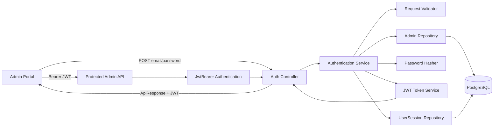
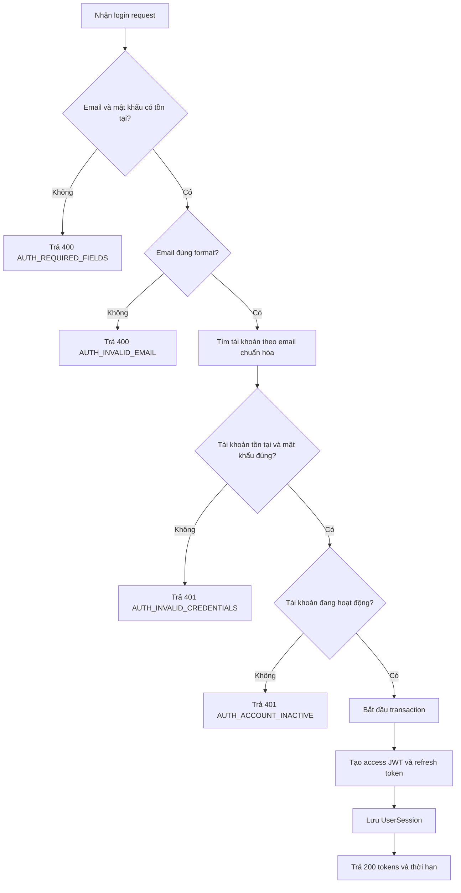
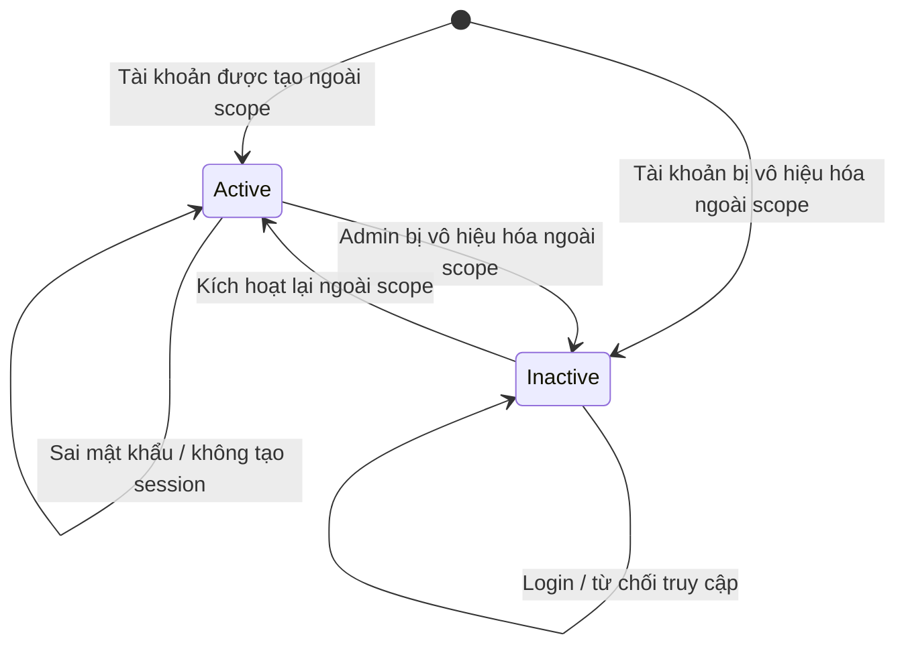
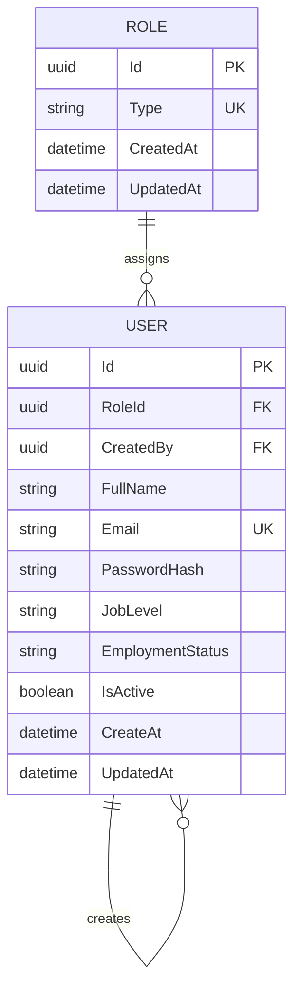

# TDD-001

## Document Info

- **Feature**: Đăng nhập VNZ quản trị viên Portal
- **Author**: Chưa chỉ định
- **Reviewer**: Chưa chỉ định
- **Status**: Draft
- **Version**: v1.1
- **Updated At**: 2026-09-22

## Context & Goals

### Problem

Website công khai không yêu cầu đăng nhập, nhưng khu vực quản trị viên cần giới hạn cho quản trị viên có tài khoản đang hoạt động. Repository hiện đã có cấu hình JWT Bearer, middleware xử lý lỗi, entity `User`/`Role`/`UserSession` và `AppDbContext` với mapping database; các endpoint login, refresh, logout và application service vẫn chưa được triển khai. API response sẽ tuân theo ApiResponse/ResponseBuilder contract được chốt trong TDD.

### Goals

- Cho phép quản trị viên gửi email và mật khẩu để đăng nhập.
- Mọi User có tài khoản đang hoạt động và mật khẩu đúng đều được cấp JWT, kể cả User có `RoleId=null`; chỉ User có role Admin mới truy cập Dashboard và endpoint quản trị.
- Tạo JWT session hợp lệ sau khi xác thực thành công.
- Access token có thời hạn 30 phút; refresh token có thời hạn 3 ngày kể từ lúc được cấp.
- Trả `fullName` trong login response để FE hiển thị trên Header; không cần endpoint `/me`.
- Trả access token và refresh token cùng thời hạn tương ứng khi đăng nhập thành công.
- Cho phép đổi refresh token còn hiệu lực lấy access token và refresh token mới; token cũ bị thu hồi.
- Cho phép đăng xuất bằng cách thu hồi refresh token của phiên hiện tại; logout lặp lại vẫn thành công.
- Từ chối sai thông tin, tài khoản không hoạt động và request thiếu dữ liệu mà không tạo session.
- Bảo vệ các endpoint quản trị bằng authentication server-side, không dựa vào ẩn/hiện UI.
- Không yêu cầu đăng nhập đối với nội dung website công khai.

### Non-goals

- Tạo tài khoản quản trị viên trên UI.
- Quên hoặc đặt lại mật khẩu.
- Phân quyền HR/Staff.
- Xây dựng chức năng Dashboard ngoài việc điều hướng tới vùng đã bảo vệ.

## Architecture



Notes:

- Database là source of truth cho email, trạng thái hoạt động và password hash.
- Mật khẩu plaintext chỉ tồn tại trong request/kiểm tra tức thời; không được lưu hoặc ghi log.
- Access JWT được FE gửi bằng Bearer; refresh token được FE gửi trong request body.
- Mỗi login/refresh thành công tạo bản ghi phiên `UserSession`; refresh thu hồi phiên/token cũ trước khi tạo phiên/token mới. Mỗi refresh token mới có hạn 3 ngày kể từ lúc được cấp.
- Không tạo token hoặc session khi validation, xác thực hoặc kiểm tra trạng thái thất bại.
- Không gọi external service.
- Các endpoint quản trị phải có `[Authorize]`; endpoint đăng nhập dùng `[AllowAnonymous]`.

## Sequence Diagram

```mermaid
sequenceDiagram
    actor Admin as Quản trị viên
    participant UI as Admin Portal
    participant API as AuthController
    participant SVC as AuthenticationService
    participant DB as PostgreSQL
    participant JWT as JwtTokenService

    Admin->>UI: Nhập email, mật khẩu, chọn Đăng nhập
    UI->>API: POST /api/v1/auth/login
    API->>SVC: Authenticate(email, password)
    SVC->>SVC: Validate required fields and email format
    alt Thiếu hoặc sai format
        SVC-->>API: Validation failure
        API-->>UI: 400 ApiResponse failure
    else Dữ liệu hợp lệ
        SVC->>DB: Tìm User theo email
        SVC->>SVC: Verify password hash
        alt Không tìm thấy hoặc sai mật khẩu
            SVC-->>API: Invalid credentials
            API-->>UI: 401, không tạo JWT
        else Tài khoản inactive
            SVC-->>API: Inactive account
            API-->>UI: 401, không tạo JWT
        else Hợp lệ
            SVC->>JWT: Tạo access token; thêm role claim nếu User có Role
            SVC->>JWT: Tạo refresh token
            SVC->>DB: Lưu UserSession
            JWT-->>SVC: Access token, refresh token và thời hạn
            SVC-->>API: Tokens, fullName và thời hạn
            API-->>UI: 200 ApiResponse success
            UI->>API: Request Dashboard với Bearer JWT
            API-->>UI: Cho phép nếu token hợp lệ
        end
    end

    UI->>API: POST /api/v1/auth/refresh {refreshToken}
    API->>SVC: Refresh(refreshToken)
    SVC->>DB: Kiểm tra session, User active và refresh token còn hạn/chưa thu hồi
    SVC->>DB: Thu hồi session cũ và lưu session mới
    SVC->>JWT: Cấp access token và refresh token mới
    API-->>UI: 200 tokens mới và thời hạn

    UI->>API: POST /api/v1/auth/logout {refreshToken}
    API->>SVC: Logout(refreshToken)
    SVC->>DB: Thu hồi session tương ứng nếu còn hoạt động
    API-->>UI: 200 success (idempotent)
```

## Activity Diagram



## State Diagram



Story không yêu cầu API chuyển trạng thái tài khoản; các transition tạo/vô hiệu hóa/kích hoạt nằm ngoài scope. Login không tự chuyển trạng thái.

## Data Model

### User và Role

`VNZ.Repository/Entity/User.cs`, `Role.cs` và `VNZ.Repository/Data/AppDbContext.cs` đã có entity, `DbSet` và Fluent API mapping tương ứng với bảng `User` và `Role` trong ERD. Login dùng `User.Email`, `User.PasswordHash`, `User.IsActive`, `User.RoleId` và kiểm tra `Role.Type` là `Admin`.

| Field | Type | Required/Nullable | Default | Key/Relationship | Constraint/Index | Ownership | Lineage/Compatibility |
|---|---|---|---|---|---|---|---|
| `User.Id` | UUID | Required | Generated | Primary key | PK index | System | Đã có trong `User` |
| `User.Email` | varchar(320) | Required | — | — | Unique index | Admin account | Input login, trim/lowercase trước lookup |
| `User.PasswordHash` | varchar(500) | Required | — | — | Không expose; one-way hash | Admin account | Đã có trong `User` |
| `User.IsActive` | boolean | Required | — | — | Filter login chỉ nhận `true` | User account | Đã có trong `User` |
| `User.RoleId` | UUID | Nullable | — | FK → `Role.Id` | Index qua FK | System | Đã map trong `AppDbContext` |
| `Role.Id` | UUID | Required | Generated | Primary key | PK index | System | Đã có trong `Role` |
| `Role.Type` | varchar(100) | Required | — | — | Unique index | Authorization | Giá trị `Admin` dùng cho guard |



`User.RoleId` trỏ tới `Role.Id`; `User.RoleId = null` vẫn được phép đăng nhập khi `IsActive=true`, nhưng token không có role claim, vì vậy không truy cập được endpoint yêu cầu Admin. `User.CreatedBy` là self-reference tới `User.Id`. Hai quan hệ này đã được cấu hình trong `AppDbContext` với `DeleteBehavior.Restrict`. Không có `LastLoginAtUtc` hoặc bảng login audit trong scope này.

### UserSession

Entity `UserSession` được map tới bảng `UserSession` trong `AppDbContext`; mỗi bản ghi đại diện cho một refresh session của User.

Theo quyết định hiện tại, `RefreshToken` được lưu nguyên giá trị token thô trong DB, không hash.

| Field | Type | Required/Nullable | Key/Relationship | Constraint/Index |
|---|---|---|---|---|
| `UserSession.Id` | UUID | Required | Primary key | PK |
| `UserSession.UserId` | UUID | Required | FK → `User.Id` | Index with `ExpiresAt` |
| `UserSession.RefreshToken` | string | Required | — | Unique index |
| `UserSession.ExpiresAt` | DateTimeOffset | Required | — | Index with `UserId` |
| `UserSession.IsRevoked` | boolean | Required | — | Refresh chỉ chấp nhận `false` |
| `UserSession.CreatedAt` | DateTimeOffset | Required | — | — |
| `UserSession.UpdatedAt` | DateTimeOffset | Nullable | — | — |

Khi refresh thành công, session cũ được đánh dấu `IsRevoked=true` và session mới được tạo. Logout đánh dấu session tương ứng đã thu hồi. Access JWT là bearer token; logout thu hồi refresh session nhưng không làm access JWT đã phát hành mất hiệu lực tức thì, token đó còn được chấp nhận tới khi hết hạn.

### Relationship and migration

`User`, `Role` và `UserSession` đã được map trong `AppDbContext`; không tạo bảng tài khoản mới. Chưa tạo hoặc áp dụng migration; migration sẽ được tạo khi bắt đầu triển khai logic. `PasswordHash` không xuất hiện trong DTO response, log hoặc JWT claims. Không thêm role matrix vì phân quyền HR/Staff nằm ngoài scope; token chứa role `Admin` để bảo vệ vùng quản trị.

## Internal API

### Endpoints

- **POST** `/api/v1/auth/login` — xác thực User đang hoạt động và cấp JWT.
  - Authentication: `AllowAnonymous`.
  - Request body: `{ "email": "admin@example.com", "password": "P@ssword123" }`.
  - `email`: string, required, non-null, trim, lowercase để tra cứu, tối đa 320 ký tự, format email.
  - `password`: string, required, non-null, không trim nội dung, giới hạn tối đa 256 ký tự.
  - Unknown fields: reject với `AUTH_INVALID_REQUEST`.
  - Success: HTTP 200 và tạo JWT.
  - `accessToken` hết hạn sau 30 phút kể từ khi cấp.
  - `refreshToken` hết hạn sau 3 ngày kể từ khi cấp.
  - Response `data`: `accessToken`, `tokenType="Bearer"`, `expiresAt`, `refreshToken`, `refreshTokenExpiresAt`, `fullName`.
  - Lưu refresh session vào `UserSession`.
  - Không tồn tại/sai mật khẩu: HTTP 401, không tiết lộ email có tồn tại hay không.
  - Inactive: HTTP 401, không tạo JWT.

- **POST** `/api/v1/auth/refresh` — đổi refresh token lấy cặp token mới.
  - Authentication: `AllowAnonymous`; refresh token được gửi trong body `{ "refreshToken": "<refresh-token>" }`.
  - `refreshToken`: string, required, non-empty.
  - Chỉ chấp nhận token có session tồn tại, chưa hết hạn, chưa thu hồi và User vẫn đang hoạt động.
  - Success: HTTP 200; thu hồi session cũ, lưu session mới và trả `accessToken`, `tokenType="Bearer"`, `expiresAt`, `refreshToken`, `refreshTokenExpiresAt`.
  - Access token mới hết hạn sau 30 phút; refresh token mới hết hạn sau 3 ngày kể từ thời điểm refresh.
  - Token không hợp lệ, hết hạn, đã thu hồi hoặc User inactive: HTTP 401 `AUTH_INVALID_REFRESH_TOKEN`; không cấp token mới.

- **POST** `/api/v1/auth/logout` — thu hồi refresh session hiện tại.
  - Authentication: `AllowAnonymous`; body `{ "refreshToken": "<refresh-token>" }`.
  - `refreshToken`: string, required, non-empty.
  - Nếu session còn hoạt động, đặt `IsRevoked=true`.
  - Token đã thu hồi hoặc không còn tìm thấy vẫn trả HTTP 200 để logout idempotent; không tiết lộ session có tồn tại hay không.
  - Logout không blacklist access JWT; access token hiện tại còn hiệu lực đến `expiresAt`.

- **GET** `/api/v1/admin/dashboard` — ví dụ endpoint quản trị được bảo vệ để xác minh AC-004.
  - Authentication: Bearer JWT bắt buộc.
  - Authorization: claim role `Admin`; User không có role claim bị từ chối 403 khi gọi endpoint Admin.
  - Chưa xác thực hoặc token invalid/expired: HTTP 401.
  - Đã xác thực nhưng không có role Admin: HTTP 403.
  - Endpoint cụ thể của Dashboard chưa thuộc phạm vi STORY-001; endpoint này chỉ đại diện cho guard bảo vệ vùng quản trị.

### Examples

#### POST /api/v1/auth/login — thành công

```http
POST /api/v1/auth/login HTTP/1.1
Content-Type: application/json

{"email":"admin@example.com","password":"P@ssword123"}
```

```json
{"isSuccess":true,"message":"Đăng nhập thành công.","data":{"accessToken":"<jwt>","tokenType":"Bearer","expiresAt":"2026-09-21T10:30:00Z","refreshToken":"<refresh-token>","refreshTokenExpiresAt":"2026-09-24T10:00:00Z","fullName":"Nguyễn Văn A"},"errors":null,"traceId":null,"timestampUtc":"2026-09-21T10:00:00Z"}
```

Side effect: tạo JWT; không trả `PasswordHash`.

#### POST /api/v1/auth/refresh — thành công

```http
POST /api/v1/auth/refresh HTTP/1.1
Content-Type: application/json

{"refreshToken":"<current-refresh-token>"}
```

```json
{"isSuccess":true,"message":"Làm mới phiên đăng nhập thành công.","data":{"accessToken":"<new-jwt>","tokenType":"Bearer","expiresAt":"2026-09-21T10:30:00Z","refreshToken":"<new-refresh-token>","refreshTokenExpiresAt":"2026-09-24T10:00:00Z"},"errors":null,"traceId":null,"timestampUtc":"2026-09-21T10:00:00Z"}
```

Token refresh cũ bị thu hồi; FE thay cả access token và refresh token bằng giá trị mới.

#### POST /api/v1/auth/logout — thành công hoặc lặp lại

```http
POST /api/v1/auth/logout HTTP/1.1
Content-Type: application/json

{"refreshToken":"<current-refresh-token>"}
```

```json
{"isSuccess":true,"message":"Đăng xuất thành công.","data":null,"errors":null,"traceId":null,"timestampUtc":"2026-09-21T10:00:00Z"}
```

Logout thu hồi refresh session; request lặp lại vẫn trả HTTP 200. Access JWT đã cấp không bị thu hồi ngay.

#### POST /api/v1/auth/refresh — refresh token không hợp lệ

```json
{"refreshToken":"<invalid-or-expired-refresh-token>"}
```

HTTP 401; controller dùng `ResponseBuilder.ErrorResponse` và giữ nguyên ApiResponse envelope:

```json
{"isSuccess":false,"message":"Refresh token không hợp lệ hoặc đã hết hạn.","data":null,"errors":{"code":"AUTH_INVALID_REFRESH_TOKEN","fields":[]},"traceId":"00-1bd9b83f1d0610560f0e52aed8196506-2bf630f9ce1a8a1a-00","timestampUtc":"2026-09-21T10:00:00Z"}
```

#### POST /api/v1/auth/logout — thiếu refresh token

```json
{}
```

HTTP 400; lỗi validation cũng dùng cùng ApiResponse envelope:

```json
{"isSuccess":false,"message":"Refresh token là bắt buộc.","data":null,"errors":{"code":"AUTH_REQUIRED_REFRESH_TOKEN","fields":["refreshToken"]},"traceId":"00-1bd9b83f1d0610560f0e52aed8196506-2bf630f9ce1a8a1a-00","timestampUtc":"2026-09-21T10:00:00Z"}
```

#### POST /api/v1/auth/login — thiếu field

```json
{"email":"admin@example.com","password":""}
```

```json
{"isSuccess":false,"message":"Vui lòng nhập email và mật khẩu.","data":null,"errors":{"code":"AUTH_REQUIRED_FIELDS","fields":["password"]},"traceId":"00-1bd9b83f1d0610560f0e52aed8196506-2bf630f9ce1a8a1a-00","timestampUtc":"2026-09-21T10:00:00Z"}
```

HTTP 400; không query tài khoản, không ghi database, không tạo token.

#### POST /api/v1/auth/login — sai email format

```json
{"email":"admin","password":"P@ssword123"}
```

```json
{"isSuccess":false,"message":"Email không đúng định dạng.","data":null,"errors":{"code":"AUTH_INVALID_EMAIL","fields":["email"]},"traceId":"00-1bd9b83f1d0610560f0e52aed8196506-2bf630f9ce1a8a1a-00","timestampUtc":"2026-09-21T10:00:00Z"}
```

HTTP 400; không tạo token.

#### POST /api/v1/auth/login — sai thông tin

```json
{"email":"admin@example.com","password":"wrong"}
```

```json
{"isSuccess":false,"message":"Email hoặc mật khẩu không chính xác.","data":null,"errors":{"code":"AUTH_INVALID_CREDENTIALS","fields":[]},"traceId":"00-1bd9b83f1d0610560f0e52aed8196506-2bf630f9ce1a8a1a-00","timestampUtc":"2026-09-21T10:00:00Z"}
```

HTTP 401; không tạo token.

#### POST /api/v1/auth/login — tài khoản inactive

```json
{"email":"inactive@example.com","password":"P@ssword123"}
```

```json
{"isSuccess":false,"message":"Tài khoản đã bị vô hiệu hóa.","data":null,"errors":{"code":"AUTH_ACCOUNT_INACTIVE","fields":[]},"traceId":"00-1bd9b83f1d0610560f0e52aed8196506-2bf630f9ce1a8a1a-00","timestampUtc":"2026-09-21T10:00:00Z"}
```

HTTP 401; không tạo token.

#### GET /api/v1/admin/dashboard — chưa đăng nhập

```http
GET /api/v1/admin/dashboard HTTP/1.1
```

HTTP 401; không chạy application handler và không có side effect.

### Error Codes

| Code | HTTP | Điều kiện | Retryable | Side effect |
|---|---:|---|---|---|
| `AUTH_REQUIRED_FIELDS` | 400 | Thiếu hoặc rỗng email/password | Không | Không |
| `AUTH_REQUIRED_REFRESH_TOKEN` | 400 | Thiếu hoặc rỗng refreshToken trong refresh/logout request | Không | Không |
| `AUTH_INVALID_EMAIL` | 400 | Email sai format hoặc vượt giới hạn | Không | Không |
| `AUTH_INVALID_REQUEST` | 400 | JSON sai kiểu hoặc có field không được phép | Không | Không |
| `AUTH_INVALID_CREDENTIALS` | 401 | Email không tồn tại hoặc password sai | Không | Không |
| `AUTH_ACCOUNT_INACTIVE` | 401 | Tài khoản tồn tại nhưng `IsActive=false` | Không | Không |
| `AUTH_INVALID_REFRESH_TOKEN` | 401 | Refresh token không hợp lệ, hết hạn/đã thu hồi hoặc User không còn active | Không | Không cấp token; session không đổi |
| `AUTH_UNAUTHENTICATED` | 401 | Gọi API quản trị không có JWT hợp lệ | Sau khi login | Không |
| `AUTH_FORBIDDEN` | 403 | JWT hợp lệ nhưng không có role Admin | Không | Không |
| `INTERNAL_ERROR` | 500 | Lỗi không dự kiến | Có thể retry | Theo transaction |

Controller gọi `ResponseBuilder.ErrorResponse` cho lỗi; response giữ nguyên ApiResponse envelope với `isSuccess=false`, `message`, `data=null`, `errors`, `traceId` và `timestampUtc`. `errors` chứa `code` và `fields`; HTTP status được trả theo loại lỗi. Refresh/logout dùng cùng envelope và builder như các lỗi Auth khác. Không lưu hoặc trả `LastLoginAtUtc`.

## External API

### Endpoints

Feature không gọi hệ thống bên thứ ba. JWT được tạo trong backend bằng cấu hình hiện có `Jwt:Key`, `Jwt:Issuer` và `Jwt:Audience`.

### Fields

Không có external request/response mapping.

### Error Handling

Không có timeout, retry hoặc provider error. Lỗi tạo token được xử lý như lỗi nội bộ và không trả token không hoàn chỉnh.

### Quirks

Không có hành vi bất thường của hệ thống ngoài.

## References

### User Stories

- `STORY-001` — Là một quản trị viên, tôi muốn đăng nhập vào VNZ quản trị viên Portal để truy cập các chức năng quản trị nội bộ. Version `v0.1`, approval state `Draft`.

### Business Rules

- `BR-001` — Xác thực User và điều kiện truy cập khu vực quản trị. Version `v0.1`, approval state `Draft`, effective date `2026-09-21`.
  - Trace: `AC-001` đến `AC-003`, `AC-006` đến `AC-008`, `EXC-01` đến `EXC-03`.
  - Reference đã resolved trong `STORY-001`.
- `BR-002` — Phạm vi xác thực giữa User, Admin và website công khai. Version `v0.1`, approval state `Draft`, effective date `2026-09-21`.
  - Trace: `AC-004` đến `AC-006` và Non-Functional.
  - Reference đã resolved trong `STORY-001`.

### Use Cases

- Không có tài liệu Use Case riêng.

### Others

- `VNZ.Api/Program.cs`: pipeline middleware, authentication, authorization và controller mapping hiện có.
- `VNZ.Api/Extensions/ServiceCollectionExtensions.cs`: JWT Bearer configuration, EF Core PostgreSQL và Swagger security definition.
- `VNZ.Api/Middleware/GlobalExceptionHandlerMiddleware.cs`: mapping exception sang HTTP status và `ApiResponse`.
- `VNZ.Service/Models/ApiResponse.cs`: response envelope hiện có.
- `VNZ.Repository/Entity/UserSession.cs` và `VNZ.Repository/Data/AppDbContext.cs`: entity, `DbSet` và mapping bảng `UserSession` cho refresh session.

## Change Log

#### v1.0 (2026-09-21)

- **Change**: Tạo bản nháp TDD cho `STORY-001`, bao phủ AC-001 đến AC-005, EXC-01 đến EXC-03 và BR-001.
- **Author**: Chưa chỉ định.

#### v1.1 (2026-09-22)

- **Change**: Chốt login trả access/refresh token, `fullName`, access token 30 phút, refresh token 3 ngày; bổ sung contract refresh rotation, logout idempotent và mapping `UserSession`.
- **Author**: Chưa chỉ định.
