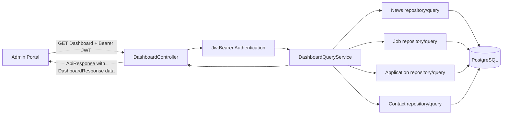
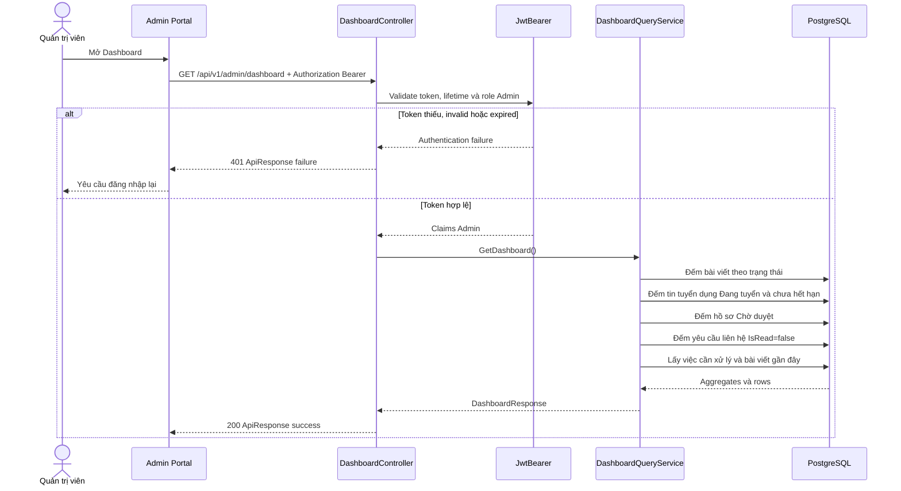
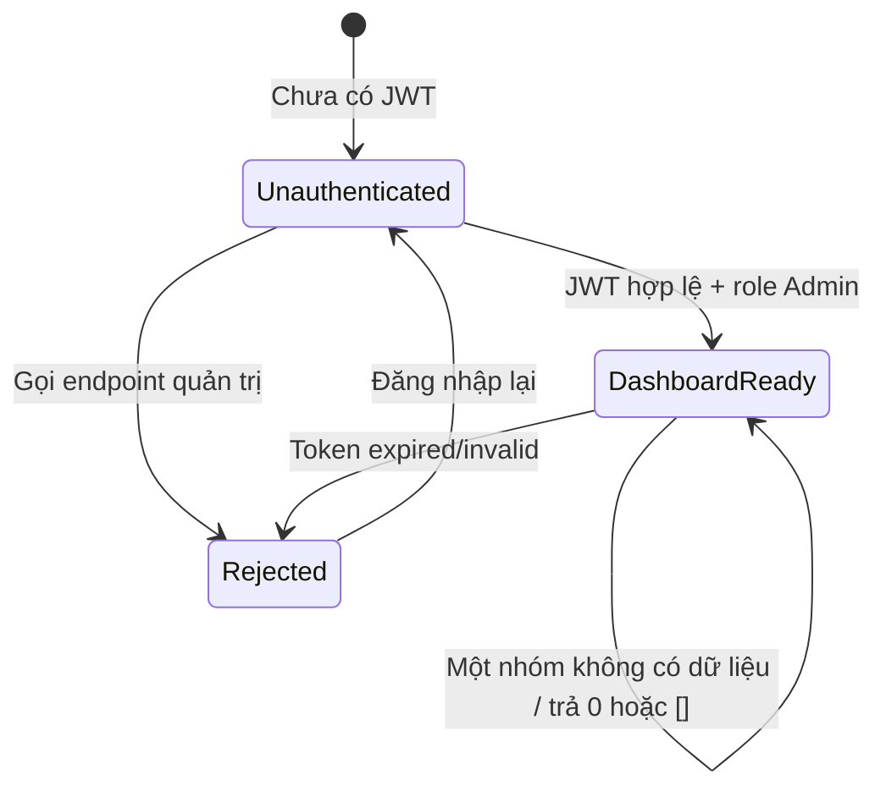
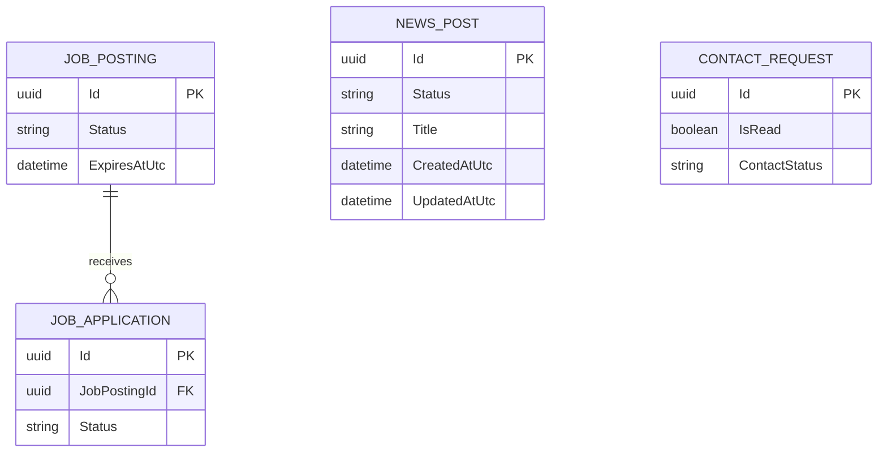

# TDD-002

## Document Info

- **Feature**: Dashboard tổng quan quản trị viên
- **Author**: Chưa chỉ định
- **Reviewer**: Chưa chỉ định
- **Status**: Draft
- **Version**: v1.0
- **Updated At**: 2026-09-21

## Context & Goals

### Problem

Quản trị viên cần một màn hình tổng quan để nhanh chóng biết tình trạng nội dung và các việc cần xử lý. Dashboard phải tổng hợp từ dữ liệu nguồn hiện tại của bài viết, tin tuyển dụng, hồ sơ ứng tuyển và yêu cầu liên hệ. Repository hiện đã có pipeline JWT Bearer, PostgreSQL, middleware lỗi, entity nguồn và `AppDbContext` mapping; module Dashboard, query và controller vẫn chưa được triển khai. API response tuân theo ApiResponse/ResponseBuilder contract được chốt trong TDD.

### Goals

- Chỉ cho quản trị viên đã xác thực truy cập Dashboard.
- Hiển thị số bài viết theo từng trạng thái.
- Hiển thị số tin tuyển dụng đang mở: trạng thái `Đang tuyển` và chưa hết hạn.
- Hiển thị số hồ sơ ứng tuyển `Chờ duyệt`, loại trừ `Đã duyệt`, `Không duyệt` và `Đã gửi email phỏng vấn`.
- Hiển thị số yêu cầu liên hệ chưa đọc dựa trên `IsRead=false`, không phụ thuộc trạng thái liên hệ.
- Hiển thị các việc cần xử lý và danh sách bài viết gần đây.
- Tính số liệu từ dữ liệu nguồn hiện tại, không lưu số đếm dẫn xuất thành cột cố định.
- Khi một nhóm không có dữ liệu, trả `0` hoặc danh sách rỗng mà không làm hỏng các nhóm còn lại.
- Khi phiên hết hiệu lực, từ chối dữ liệu Dashboard và yêu cầu đăng nhập lại.

### Non-goals

- Báo cáo BI nâng cao.
- Partner và Create Product vì chưa có màn hình hoàn chỉnh.
- Tạo hoặc chỉnh sửa bài viết, tin tuyển dụng, hồ sơ ứng tuyển hoặc yêu cầu liên hệ.
- Lưu cache số đếm dẫn xuất thành các cột cố định.

## Architecture



Notes:

- Các bảng nghiệp vụ là source of truth; Dashboard chỉ đọc và tính toán tại thời điểm request.
- Không ghi database trong flow tải Dashboard và không tạo cột count dẫn xuất.
- Authentication xảy ra trước application handler; request không có JWT hợp lệ không được chạy các query Dashboard.
- Mỗi nhóm số liệu có query độc lập hoặc projection độc lập. Một nhóm rỗng trả `0`/`[]`; không dùng null để biểu diễn không có dữ liệu.
- Các query của một lần tải sử dụng cùng transaction isolation/read snapshot nếu repository chốt transaction read-only; nếu không, response được xem là snapshot theo thời điểm từng query. Không có yêu cầu idempotency vì operation chỉ đọc.
- Không gọi external service.

## Sequence Diagram



## Activity Diagram

```mermaid
flowchart TD
    A[Nhận GET Dashboard] --> B{Có Bearer token?}
    B -- Không --> E1[401 AUTH_UNAUTHENTICATED]
    B -- Có --> C{Token hợp lệ, chưa hết hạn, role Admin?}
    C -- Không xác thực --> E1
    C -- Không đủ quyền --> E2[403 AUTH_FORBIDDEN]
    C -- Có --> D[Khởi tạo read-only query context]
    D --> N[Đếm bài viết theo trạng thái]
    D --> J[Đếm job Đang tuyển và chưa hết hạn]
    D --> A1[Đếm application Chờ duyệt]
    D --> C1[Đếm contact IsRead=false]
    D --> T[Lấy việc cần xử lý]
    D --> R[Lấy bài viết gần đây]
    N --> M[Gộp các nhóm; nhóm rỗng = 0/[]]
    J --> M
    A1 --> M
    C1 --> M
    T --> M
    R --> M
    M --> S[Trả 200 DashboardResponse]
    N -. DB failure .-> E3[500 DASHBOARD_DATA_ACCESS_FAILED]
    J -. DB failure .-> E3
    A1 -. DB failure .-> E3
    C1 -. DB failure .-> E3
    T -. DB failure .-> E3
    R -. DB failure .-> E3
```

## State Diagram



Dashboard không thay đổi trạng thái nghiệp vụ của bài viết, tin tuyển dụng, hồ sơ ứng tuyển hoặc yêu cầu liên hệ; state diagram chỉ mô tả trạng thái truy cập và trạng thái đọc dữ liệu của màn hình.

## Data Model

### Source entities đã có trong repository

Các entity nguồn đã được tạo trong `VNZ.Repository/Entity` và đăng ký bằng `DbSet`/Fluent API trong `VNZ.Repository/Data/AppDbContext.cs`. Migration database và module Dashboard query/controller vẫn là phần cần triển khai.

| Entity/table | Field dùng cho Dashboard | Type | Required/Nullable | Key/index/constraint | Ownership | Lineage/compatibility |
|---|---|---|---|---|---|---|
| `NewsArticle` (`News_Article`) | `Id`, `Status`, `Title`, `CreatedAt`, `UpdatedAt`, `Published` | UUID, `NewsStatus`, varchar, timestamptz, boolean | `Id/Status/Title/CreatedAt` required; các field còn lại theo entity | PK; index `Status`, `CreatedAt` | News module | Nguồn cho status counts và recent posts |
| `JobPost` (`Job_Post`) | `Id`, `Status`, `ExpiredAt`, `Title` | UUID, `JobPostStatus`, timestamptz, varchar | `Id/Status/Title` required; `ExpiredAt` nullable | PK; index `(Status, ExpiredAt)` | Recruitment module | Nguồn cho open jobs |
| `JobApplication` (`Job_Application`) | `Id`, `JobPostId`, `Status` | UUID, UUID, `JobApplicationStatus` | Required | PK; FK → `JobPost.Id`; index `Status` | Recruitment module | Nguồn cho pending applications |
| `ContactInquiry` (`Contact_Inquiry`) | `Id`, `IsRead`, `ContactStatus` | UUID, boolean, `ContactStatus` nullable | `Id/IsRead` required; `ContactStatus` nullable | PK; index `IsRead` | Contact module | Nguồn cho unread contacts |

Derived dashboard fields:

| Response field | Derivation | Empty result |
|---|---|---|
| `totalNewsCount` | Tổng số bản ghi `NewsArticle`, không lọc theo trạng thái; dùng cho card **Bài viết** | `0` |
| `newsByStatus` | `GROUP BY NewsPost.Status` | `{}` hoặc các status đã biết có value `0`; contract chọn `{}` cho status không có row |
| `openJobsCount` | `JobPosting.Status = Đang tuyển AND (ExpiresAtUtc IS NULL OR ExpiresAtUtc > nowUtc)`; nếu BR/Story chốt null expiry là không hợp lệ thì validator phải loại record đó | `0` |
| `pendingApplicationsCount` | `JobApplication.Status = Chờ duyệt` | `0` |
| `unreadContactsCount` | `ContactRequest.IsRead = false`; không kiểm tra `ContactStatus` | `0` |
| `pendingTasks` | Các nhóm việc cần xử lý được định nghĩa từ các số liệu đã có trong Story; không thêm nhóm Partner/Create Product | `[]` |
| `recentPosts` | `NewsPost` sắp xếp `CreatedAtUtc DESC`, giới hạn `5` record gần đây | `[]` |

Relationship:



Migration/compatibility:

- Các entity và mapping đã có trong repository; chỉ tạo migration database khi môi trường chưa có các bảng tương ứng.
- Không thêm `NewsCount`, `OpenJobsCount`, `PendingApplicationsCount` hoặc `UnreadContactsCount` vào bảng nguồn.
- Tên enum trạng thái phải dùng đúng canonical values trong module nghiệp vụ; các giá trị Story xác định chắc chắn gồm `Chờ duyệt`, `Đã duyệt`, `Không duyệt`, `Đã gửi email phỏng vấn`, `Đang tuyển`, `Đã đóng`.
- Dashboard query không được sửa dữ liệu nguồn.

## Internal API

### Endpoints

- **GET** `/api/v1/admin/dashboard` — trả dữ liệu tổng quan cho quản trị viên.
  - Actor: quản trị viên.
  - Permission: Bearer JWT hợp lệ và role `Admin`.
  - Query/path/body: không có.
  - Headers: `Authorization: Bearer <jwt>` bắt buộc.
  - Success response: HTTP 200 với `ApiResponse`; `data` có cấu trúc DashboardResponse.
  - Không phân trang Dashboard; `recentPosts` cố định tối đa `5` item để giữ response bounded.
  - Không nhận filter/sort từ client trong Story này.
  - Không có write, external call, idempotency key hoặc concurrency mutation.

`DashboardResponse`:

| Field | Type | Required/Nullable | Source |
|---|---|---|---|
| `totalNewsCount` | integer | Required, không null, >= 0 | Tổng mọi `NewsPost`, không lọc status; card **Bài viết** |
| `newsByStatus` | object<string, integer> | Required, không null | `NewsPost.Status` group count |
| `openJobsCount` | integer | Required, không null, >= 0 | `JobPosting` theo BR-006 |
| `pendingApplicationsCount` | integer | Required, không null, >= 0 | `JobApplication` theo BR-004 |
| `unreadContactsCount` | integer | Required, không null, >= 0 | `ContactRequest.IsRead` theo BR-005 |
| `pendingTasks` | array<PendingTask> | Required, không null | Derived từ các nhóm cần xử lý |
| `recentPosts` | array<RecentPost> | Required, không null, 0–5 item | `NewsPost`, `CreatedAtUtc DESC` |

`PendingTask` gồm `type` (string enum nội bộ), `count` (integer >= 0), `label` (string). Chỉ trả task thuộc các nguồn trong Story; không trả Partner/Create Product.

`RecentPost` gồm `id` (UUID), `title` (string), `authorName` (string), `status` (string enum), `createdAtUtc` (ISO-8601 UTC). `id`, `title` và `authorName` lấy từ dữ liệu bài viết/tác giả tương ứng; không trả body nội dung bài viết.

Validation/ordering:

1. ASP.NET Core authentication validate chữ ký, issuer, audience và lifetime của JWT.
2. Authorization kiểm tra role `Admin`.
3. Chạy các read queries; không query database trước khi qua auth guard.
4. Chuẩn hóa aggregate rỗng thành `0`/`[]`, sau đó serialize response.

### Examples

#### GET /api/v1/admin/dashboard — có dữ liệu

```http
GET /api/v1/admin/dashboard HTTP/1.1
Authorization: Bearer <valid-admin-jwt>
```

```json
{"success":true,"message":"Lấy dữ liệu tổng quan thành công.","data":{"totalNewsCount":8,"newsByStatus":{"Bản nháp":2,"Đã đăng":5,"Đã đóng":1},"openJobsCount":3,"pendingApplicationsCount":4,"unreadContactsCount":2,"pendingTasks":[{"type":"PendingApplications","count":4,"label":"Hồ sơ ứng tuyển chờ duyệt"},{"type":"UnreadContacts","count":2,"label":"Yêu cầu liên hệ chưa đọc"}],"recentPosts":[{"id":"11111111-1111-1111-1111-111111111111","title":"Bài viết mới","authorName":"Nguyễn Văn A","status":"Đã đăng","createdAtUtc":"2026-09-21T08:00:00Z"}]},"errors":null,"traceId":null,"timestampUtc":"2026-09-21T10:00:00Z"}
```

Đáp ứng main flow, BR-003, BR-004, BR-005 và BR-006; không ghi database.

#### GET /api/v1/admin/dashboard — nhóm không có dữ liệu

```json
{"success":true,"message":"Lấy dữ liệu tổng quan thành công.","data":{"totalNewsCount":0,"newsByStatus":{},"openJobsCount":0,"pendingApplicationsCount":0,"unreadContactsCount":0,"pendingTasks":[],"recentPosts":[]},"errors":null,"traceId":null,"timestampUtc":"2026-09-21T10:00:00Z"}
```

HTTP 200; các nhóm độc lập vẫn trả đủ field và không trả null.

#### GET /api/v1/admin/dashboard — token thiếu/hết hạn

```http
GET /api/v1/admin/dashboard HTTP/1.1
```

```json
{"success":false,"message":"Yêu cầu đăng nhập để tiếp tục.","data":null,"errors":{"code":"AUTH_UNAUTHENTICATED","fields":[]},"traceId":"00-1bd9b83f1d0610560f0e52aed8196506-2bf630f9ce1a8a1a-00","timestampUtc":"2026-09-21T10:00:00Z"}
```

HTTP 401; không chạy Dashboard query và UI yêu cầu đăng nhập lại.

#### GET /api/v1/admin/dashboard — token không có role Admin

```http
GET /api/v1/admin/dashboard HTTP/1.1
Authorization: Bearer <valid-non-admin-jwt>
```

```json
{"success":false,"message":"Bạn không có quyền thực hiện thao tác này.","data":null,"errors":{"code":"AUTH_FORBIDDEN","fields":[]},"traceId":"00-1bd9b83f1d0610560f0e52aed8196506-2bf630f9ce1a8a1a-00","timestampUtc":"2026-09-21T10:00:00Z"}
```

HTTP 403; không chạy Dashboard query.

#### GET /api/v1/admin/dashboard — lỗi đọc dữ liệu

```json
{"success":false,"message":"Không thể tải dữ liệu tổng quan.","data":null,"errors":{"code":"DASHBOARD_DATA_ACCESS_FAILED","fields":[]},"traceId":"00-1bd9b83f1d0610560f0e52aed8196506-2bf630f9ce1a8a1a-00","timestampUtc":"2026-09-21T10:00:00Z"}
```

HTTP 500; không trả partial success và không ghi database.

### Error Codes

| Code | HTTP | Điều kiện | Client-visible detail | Retryable | Data side effect |
|---|---:|---|---|---|---|
| `AUTH_UNAUTHENTICATED` | 401 | Thiếu, invalid hoặc expired JWT | Yêu cầu đăng nhập lại | Sau khi login lại | Không |
| `AUTH_FORBIDDEN` | 403 | JWT hợp lệ nhưng không có role Admin | Không có quyền Dashboard | Không | Không |
| `DASHBOARD_DATA_ACCESS_FAILED` | 500 | Lỗi đọc một hoặc nhiều source query | Không trả partial data | Có thể retry | Không |
| `INTERNAL_ERROR` | 500 | Lỗi không dự kiến khi tổng hợp/serialize | Lỗi nội bộ | Có thể retry | Không |

Repository hiện map `UnauthorizedException` thành 401. Theo response contract, controller gọi `ResponseBuilder.SuccessResponse/ErrorResponse`; middleware và controller trả cùng envelope, với HTTP status được thiết lập riêng.

## External API

### Endpoints

Feature không gọi hệ thống bên thứ ba; toàn bộ dữ liệu đọc từ PostgreSQL qua repository/application query.

### Fields

Không có external request/response mapping.

### Error Handling

Không có provider timeout, retry hoặc malformed external response. Database read failure được map thành `DASHBOARD_DATA_ACCESS_FAILED` và không trả partial response.

### Quirks

Không có hành vi bất thường của hệ thống ngoài.

## References

### User Stories

- `STORY-002` — Là một quản trị viên, tôi muốn xem Dashboard tổng quan để biết nhanh tình trạng nội dung và các việc cần xử lý. Version `v0.1`, approval state `Draft`.

### Business Rules

- `BR-002` — Phạm vi yêu cầu xác thực giữa Admin và website công khai. Version `v0.1`, approval state `Draft`, effective date `2026-09-21`.
- `BR-003` — Số liệu Dashboard phản ánh dữ liệu hiện tại. Version `v0.1`, approval state `Draft`, effective date `2026-09-21`.
- `BR-004` — Cách tính số hồ sơ ứng viên chờ duyệt trên Dashboard. Version `v0.1`, approval state `Draft`, effective date `2026-09-21`.
- `BR-005` — Cách tính số yêu cầu liên hệ chưa đọc trên Dashboard. Version `v0.1`, approval state `Draft`, effective date `2026-09-21`.
- `BR-006` — Cách xác định tin tuyển dụng đang mở trên Dashboard. Version `v0.1`, approval state `Draft`, effective date `2026-09-21`.

### Use Cases

- Không có tài liệu Use Case riêng.

### Others

- `VNZ.Api/Program.cs`: pipeline middleware, authentication, authorization và controller mapping hiện có.
- `VNZ.Api/Extensions/ServiceCollectionExtensions.cs`: JWT Bearer configuration, EF Core PostgreSQL và Swagger security definition.
- `VNZ.Api/Middleware/GlobalExceptionHandlerMiddleware.cs`: mapping exception sang HTTP status và `ApiResponse`.
- `VNZ.Service/Models/ApiResponse.cs`: response envelope hiện có.
- `VNZ.Repository/Data/AppDbContext.cs`: DbContext đã có `DbSet` và Fluent API mapping cho `NewsArticle`, `JobPost`, `JobApplication`, `ContactInquiry` cùng các entity liên quan.

## Schema Amendments

- Dashboard status fields use Vietnamese enum labels at the API/UI boundary while database enum values remain integer-backed.
- `Product.Content` is persisted as PostgreSQL JSONB for the existing Product entity.
- `User.EmploymentStatus` is persisted in the `User` table as an integer enum.

## Change Log

#### v1.0 (2026-09-21)

- **Change**: Tạo bản nháp TDD cho `STORY-002`, bao phủ AC-001 đến AC-006, ALT-01/ALT-02, EXC-01 và BR-002 đến BR-006.
- **Author**: Chưa chỉ định.
