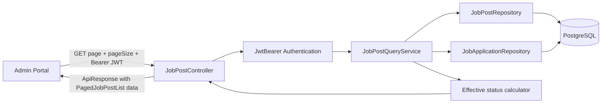
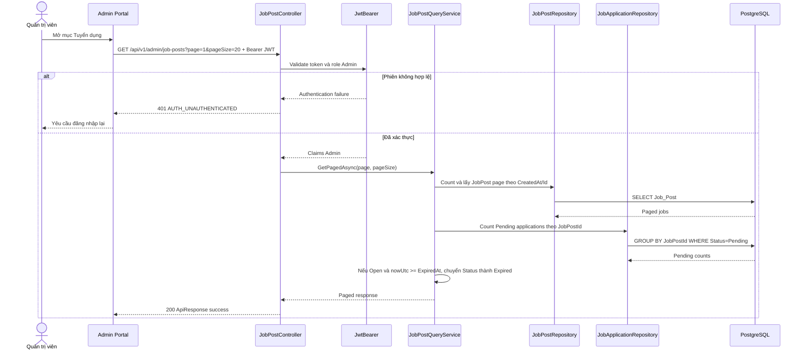
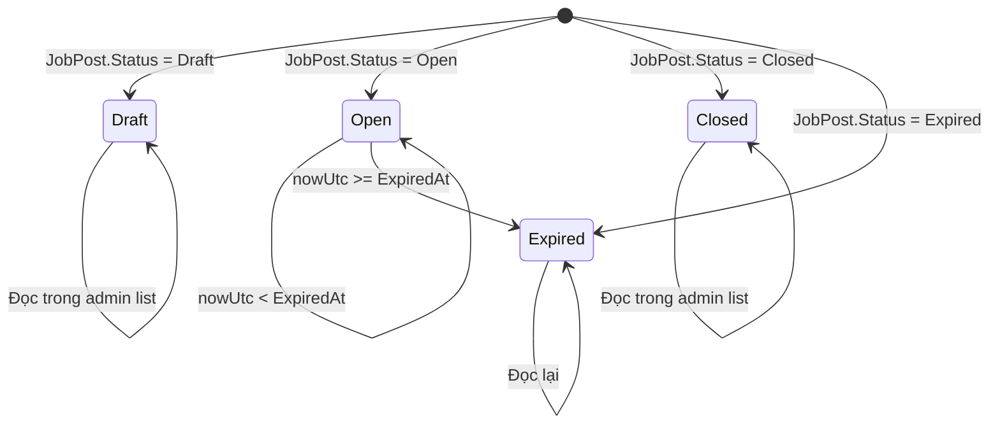
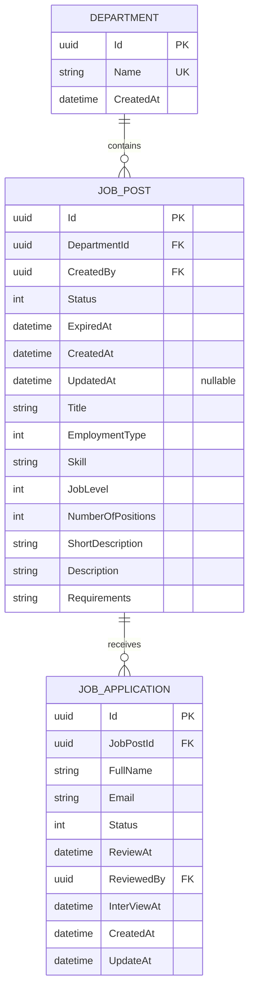

# TDD-003

## Document Info

- **Feature**: Danh sách tin tuyển dụng quản trị
- **Author**: Chưa chỉ định
- **Reviewer**: Chưa chỉ định
- **Status**: Draft
- **Version**: v1.0
- **Updated At**: 2026-09-21

## Context & Goals

### Current DB alignment

- `JobPost.Skills` is a `List<string>` stored as JSONB; there is no Skill table or Skill catalog.
- `JobPost.ExpiredAt` is required and must be in the future when `JobPost.Status=Open`; an Open record with null `ExpiredAt` is invalid.
- API status values use Vietnamese labels: `Draft` = `Bản nháp`, `Open` = `Đang tuyển`, `Closed` = `Đã đóng`, `Expired` = `Đã hết hạn`; application `Pending` = `Chờ duyệt`.

### Problem

Quản trị viên cần xem danh sách các tin tuyển dụng để theo dõi trạng thái, hạn tuyển, chỉ tiêu và số hồ sơ `Chờ duyệt` của từng vị trí. Tin `Bản nháp`, `Đang tuyển` và `Đã đóng` đều cần được quản trị viên xem; tuy nhiên chỉ tin `Đang tuyển` và còn hiệu lực mới được hiển thị trên website công khai.

Repository đã có entity `JobPost`, `JobApplication`, `Department`, enum `JobPostStatus`/`JobApplicationStatus` và mapping `AppDbContext`. Chưa có endpoint, query service, pagination contract hoặc controller cho danh sách tuyển dụng.

### Goals

- Chỉ quản trị viên đã xác thực mới được xem danh sách.
- Trả danh sách tin tuyển dụng có tiêu đề, mô tả ngắn, ngày hết hạn, chỉ tiêu và trạng thái hiệu lực.
- Hiển thị số hồ sơ `Pending` của từng tin tuyển dụng.
- Hỗ trợ phân trang ổn định.
- Giữ tin `Draft` và tin hết hạn/đã đóng trong khu vực quản trị.
- Khi `nowUtc >= ExpiredAt` của tin `Open`, hệ thống chuyển trạng thái thành `Expired`; tin không còn public.
- Tin `Expired` vẫn xuất hiện trong khu vực Admin và không được chỉnh sửa.
- Khi tin `Closed` còn hồ sơ `Pending`, vẫn trả số hồ sơ để quản trị viên tiếp tục xử lý.

### Non-goals

- Xóa tin tuyển dụng.
- Đóng tin tuyển dụng thủ công.
- Chỉnh sửa hoặc đăng tin tuyển dụng.
- Xử lý chi tiết hồ sơ ứng viên.
- Thay đổi trạng thái database chỉ vì tin đã quá hạn.

## Architecture



Notes:

- `JobPost` là source of truth cho nội dung, trạng thái lưu và `ExpiredAt`; `JobApplication` là source of truth cho số hồ sơ.
- `effectiveStatus` là giá trị dẫn xuất theo `JobPost.Status` và thời gian UTC hiện tại; không lưu cột count hoặc tự động update DB trong GET.
- Query chỉ đọc, không có transaction write, external call, idempotency hoặc retry mutation.
- Authentication và authorization hoàn tất trước khi chạy query database.
- Sort ổn định theo `CreatedAt DESC, Id DESC` để các trang không bị đảo thứ tự khi các record có cùng thời điểm.

## Sequence Diagram



## Activity Diagram

```mermaid
flowchart TD
    A[Nhận GET job posts] --> B{Có Bearer JWT?}
    B -- Không --> E1[401 AUTH_UNAUTHENTICATED]
    B -- Có --> C{JWT hợp lệ và role Admin?}
    C -- Token invalid/expired --> E1
    C -- Thiếu role --> E2[403 AUTH_FORBIDDEN]
    C -- Có --> D[Parse page/pageSize]
    D --> V{Pagination hợp lệ?}
    V -- Không --> E3[400 JOB_POST_INVALID_PAGINATION]
    V -- Có --> Q1[Lấy tổng số JobPost]
    Q1 --> Q2[Lấy page theo CreatedAt DESC, Id DESC]
    Q2 --> Q3[Lấy count Application Pending theo JobPostId]
    Q3 --> R[Tính effectiveStatus từng dòng]
    R --> S{JobPost không có dữ liệu?}
    S -- Có --> E[200 items=[] total=0]
    S -- Không --> F[Trả items + page metadata]
    Q1 -. DB error .-> E4[500 JOB_POST_DATA_ACCESS_FAILED]
    Q2 -. DB error .-> E4
    Q3 -. DB error .-> E4
```

## State Diagram



`Expired` là trạng thái được lưu trong `JobPost.Status`, khác với `Closed` do Admin đóng thủ công. Background job chạy khi khởi động và mỗi phút, chuyển mọi tin `Open` có `ExpiredAt <= UtcNow` sang `Expired`; tin không public và không được chỉnh sửa.

## Data Model

### Entity đã có trong repository

`JobPost`, `JobApplication` và `Department` đã được tạo trong `VNZ.Repository/Entity`; `AppDbContext` đã map các bảng `Job_Post`, `Job_Application` và `Department`.

| Entity/table | Field sử dụng | Type | Required/Nullable | Key/Index/Relationship | Ownership/Lineage |
|---|---|---|---|---|---|
| `JobPost` / `Job_Post` | `Id` | UUID | Required | PK từ `BaseEntity` | JobPost source |
| `JobPost` / `Job_Post` | `Status` | `JobPostStatus` | Required | Index `(Status, ExpiredAt)` | Lưu trạng thái nghiệp vụ |
| `JobPost` / `Job_Post` | `ExpiredAt` | `DateTime?` | Nullable | Thành phần index `(Status, ExpiredAt)` | UTC deadline |
| `JobPost` / `Job_Post` | `Title` | string | Required | Max 300 | Hiển thị danh sách |
| `JobPost` / `Job_Post` | `ShortDescription` | string? | Nullable | — | Hiển thị danh sách |
| `JobPost` / `Job_Post` | `NumberOfPositions` | int | Required | — | Hiển thị chỉ tiêu |
| `JobPost` / `Job_Post` | `CreatedAt` | DateTime | Required | Sort dùng `CreatedAt` | Audit thời gian |
| `JobPost` / `Job_Post` | `UpdatedAt` | DateTime? | Nullable | Null khi tạo mới; ghi khi có cập nhật | Audit thời gian |
| `JobApplication` / `Job_Application` | `Id` | UUID | Required | PK từ `BaseEntity` | Application source |
| `JobApplication` / `Job_Application` | `JobPostId` | UUID | Required | FK → `JobPost.Id` | Liên kết vị trí |
| `JobApplication` / `Job_Application` | `Status` | `JobApplicationStatus` | Required | Index `Status` | Nguồn đếm Pending |
| `Department` / `Department` | `Id`, `Name` | UUID, string | Required | PK, unique Name | Có trong entity nhưng không trả ở Story này |



`JobPost.DepartmentId` và `JobApplication.JobPostId` là các foreign key đã cấu hình trong `AppDbContext`. `JobPost.CreatedBy` và `JobApplication.ReviewedBy` trỏ về `User`, nhưng User không thuộc luồng hiển thị danh sách nên không đưa vào sơ đồ nghiệp vụ chính.

Enum mapping trong `AppDbContext` lưu `JobPostStatus` và `JobApplicationStatus` dưới dạng integer theo enum DB. Giá trị nghiệp vụ tương ứng: `Draft=1`, `Open=2`, `Closed=3`, `Expired=4`; `Pending=1`, `Accepted=2`, `Rejected=3`, `SendedEmail=4`.

Derived values:

| Response field | Rule | Side effect |
|---|---|---|
| `status` | Map stored `Draft` → `Bản nháp`, `Open` → `Đang tuyển`, `Closed` → `Đã đóng`, `Expired` → `Đã hết hạn` | Open đến hạn chuyển persisted status thành Expired |
| `pendingApplicationCount` | `COUNT(JobApplication.Id)` với cùng `JobPostId` và `Status=Pending` | Không ghi DB |
| `isPubliclyVisible` | `stored Status=Open` và (`ExpiredAt` null hoặc `nowUtc < ExpiredAt`) | Chỉ là derived response value, không phải yêu cầu bắt buộc của admin list |

## Internal API

### Endpoints

- **GET** `/api/v1/admin/job-posts` — lấy danh sách tin tuyển dụng cho quản trị viên.
  - Actor: quản trị viên.
  - Permission: Bearer JWT hợp lệ và role `Admin`.
  - Query `page`: integer, required, default `1`, min `1`.
  - Query `pageSize`: integer, optional, default `20`, min `1`, max `100`.
  - Không có request body, path parameter hoặc external header ngoài `Authorization`.
  - Unknown query parameter: ignore; không làm thay đổi query semantics.
  - Sort cố định `CreatedAt DESC, Id DESC`; client không được truyền sort tùy ý trong scope này.
  - Success: HTTP 200, `ApiResponse`; `data` có cấu trúc PagedJobPostList.
  - Không có dữ liệu: HTTP 200 với `items=[]`, `total=0`.
  - Tin `Closed` và `Expired` vẫn xuất hiện; tin hết hạn trả `status=Expired`.

`PagedJobPostList`:

| Field | Type | Required/Nullable | Source |
|---|---|---|---|
| `items` | array<JobPostListItem> | Required, không null | JobPost projection |
| `page` | integer | Required | Normalized query |
| `pageSize` | integer | Required | Normalized query |
| `total` | integer | Required, >= 0 | Count JobPost |
| `totalPages` | integer | Required, >= 0 | `ceil(total/pageSize)`; total 0 → 0 |

`JobPostListItem`:

| Field | Type | Required/Nullable | Source |
|---|---|---|---|
| `id` | UUID | Required | `JobPost.Id` |
| `title` | string | Required | `JobPost.Title` |
| `shortDescription` | string? | Nullable | `JobPost.ShortDescription` |
| `expiredAt` | ISO-8601 UTC datetime? | Nullable | `JobPost.ExpiredAt` |
| `numberOfPositions` | integer | Required, >= 0 | `JobPost.NumberOfPositions` |
| `status` | enum label string | Required | `Bản nháp`/`Đang tuyển`/`Đã đóng` |
| `pendingApplicationCount` | integer | Required, >= 0 | BR-008 |

### Examples

#### GET /api/v1/admin/job-posts — danh sách có dữ liệu

```http
GET /api/v1/admin/job-posts?page=1&pageSize=20 HTTP/1.1
Authorization: Bearer <valid-admin-jwt>
```

```json
{"success":true,"message":"Lấy danh sách tin tuyển dụng thành công.","data":{"items":[{"id":"11111111-1111-1111-1111-111111111111","title":"Backend Developer","shortDescription":"Phát triển dịch vụ backend","expiredAt":"2026-10-01T00:00:00Z","numberOfPositions":2,"status":"Đang tuyển","pendingApplicationCount":4}],"page":1,"pageSize":20,"total":1,"totalPages":1},"errors":null,"traceId":null,"timestampUtc":"2026-09-21T10:00:00Z"}
```

Đáp ứng main flow, AC-001 và AC-004.

#### GET /api/v1/admin/job-posts — trang kế tiếp

```http
GET /api/v1/admin/job-posts?page=2&pageSize=20 HTTP/1.1
Authorization: Bearer <valid-admin-jwt>
```

HTTP 200; response giữ `page=2`, thứ tự ổn định theo `CreatedAt DESC, Id DESC`, đáp ứng ALT-01.

#### GET /api/v1/admin/job-posts — tin nháp và tin đã đóng/hết hạn

```json
{"success":true,"message":"Lấy danh sách tin tuyển dụng thành công.","data":{"items":[{"id":"22222222-2222-2222-2222-222222222222","title":"Draft role","shortDescription":null,"expiredAt":null,"numberOfPositions":1,"status":"Bản nháp","pendingApplicationCount":0},{"id":"33333333-3333-3333-3333-333333333333","title":"Vị trí đã hết hạn","shortDescription":"Vị trí đã hết hạn","expiredAt":"2026-09-20T00:00:00Z","numberOfPositions":1,"status":"Đã hết hạn","pendingApplicationCount":2}],"page":1,"pageSize":20,"total":2,"totalPages":1},"errors":null,"traceId":null,"timestampUtc":"2026-09-21T10:00:00Z"}
```

Tin `Draft` vẫn có trong admin nhưng không public; tin hết hạn được trả `Closed` nhưng vẫn có trong admin và vẫn trả count Pending. Đáp ứng AC-002, AC-003, AC-005 và ALT-02.

#### GET /api/v1/admin/job-posts — không có dữ liệu

```json
{"success":true,"message":"Không tìm thấy tin tuyển dụng phù hợp.","data":{"items":[],"page":1,"pageSize":20,"total":0,"totalPages":0},"errors":null,"traceId":null,"timestampUtc":"2026-09-21T10:00:00Z"}
```

HTTP 200; không trả null và không phát sinh lỗi.

#### GET /api/v1/admin/job-posts — pagination không hợp lệ

```http
GET /api/v1/admin/job-posts?page=0&pageSize=101 HTTP/1.1
Authorization: Bearer <valid-admin-jwt>
```

```json
{"success":false,"message":"Thông tin phân trang không hợp lệ.","data":null,"errors":{"code":"JOB_POST_INVALID_PAGINATION","fields":["page","pageSize"]},"traceId":"00-1bd9b83f1d0610560f0e52aed8196506-2bf630f9ce1a8a1a-00","timestampUtc":"2026-09-21T10:00:00Z"}
```

HTTP 400; không query database.

#### GET /api/v1/admin/job-posts — phiên không hợp lệ

```json
{"success":false,"message":"Yêu cầu đăng nhập để tiếp tục.","data":null,"errors":{"code":"AUTH_UNAUTHENTICATED","fields":[]},"traceId":"00-1bd9b83f1d0610560f0e52aed8196506-2bf630f9ce1a8a1a-00","timestampUtc":"2026-09-21T10:00:00Z"}
```

HTTP 401; không query database, đáp ứng EXC-01.

#### GET /api/v1/admin/job-posts — lỗi đọc dữ liệu

```json
{"success":false,"message":"Không thể tải danh sách tin tuyển dụng.","data":null,"errors":{"code":"JOB_POST_DATA_ACCESS_FAILED","fields":[]},"traceId":"00-1bd9b83f1d0610560f0e52aed8196506-2bf630f9ce1a8a1a-00","timestampUtc":"2026-09-21T10:00:00Z"}
```

HTTP 500; không trả partial list và không ghi database.

### Error Codes

| Code | HTTP | Điều kiện | Field liên quan | Retryable | Data side effect |
|---|---:|---|---|---|---|
| `AUTH_UNAUTHENTICATED` | 401 | Thiếu, invalid hoặc expired JWT | Authorization | Sau khi login lại | Không |
| `AUTH_FORBIDDEN` | 403 | JWT hợp lệ nhưng không có role Admin | Authorization | Không | Không |
| `JOB_POST_INVALID_PAGINATION` | 400 | `page < 1`, `pageSize < 1` hoặc `pageSize > 100` | page/pageSize | Không | Không |
| `JOB_POST_DATA_ACCESS_FAILED` | 500 | Lỗi đọc JobPost/JobApplication | — | Có thể retry | Không |
| `INTERNAL_ERROR` | 500 | Lỗi không dự kiến khi project/serialize response | — | Có thể retry | Không |

Controller dùng `ResponseBuilder` để trả `ApiResponse` có `success`, `message`, `data`, `errors`, `traceId`, `timestampUtc`. Error object chứa `code` và `fields`; middleware dùng cùng contract.

## External API

### Endpoints

Feature không gọi hệ thống bên thứ ba. Dữ liệu chỉ đọc từ PostgreSQL qua `AppDbContext`/repository.

### Fields

Không có external request/response mapping.

### Error Handling

Không có provider timeout, retry hoặc malformed external response. Database read failure map thành `JOB_POST_DATA_ACCESS_FAILED`.

### Quirks

Tin hết hạn được chuyển sang `Expired` trước khi response; `Expired` là trạng thái lưu trong `JobPost.Status`, không phải trạng thái dẫn xuất.

## References

### User Stories

- `STORY-003` — Là một quản trị viên, tôi muốn xem danh sách tuyển dụng để theo dõi trạng thái, hạn tuyển và số hồ sơ Chờ duyệt của từng vị trí. Version `v0.1`, approval state `Draft`.

### Business Rules

- `BR-006` — Cách xác định tin tuyển dụng đang mở trên Dashboard. Version `v0.1`, approval state `Draft`, effective date `2026-09-21`.
- `BR-007` — Điều kiện hiển thị tin tuyển dụng trên website công khai. Version `v0.1`, approval state `Draft`, effective date `2026-09-21`.
- `BR-008` — Cách tính số hồ sơ chờ duyệt theo tin tuyển dụng. Version `v0.1`, approval state `Draft`, effective date `2026-09-21`.

### Use Cases

- Không có tài liệu Use Case riêng.

### Others

- `VNZ.Repository/Entity/JobPost.cs`: entity tin tuyển dụng.
- `VNZ.Repository/Entity/JobApplication.cs`: entity hồ sơ ứng tuyển.
- `VNZ.Repository/Entity/Department.cs`: entity phòng ban liên quan JobPost.
- `VNZ.Repository/Entity/Enum/JobPostStatus.cs`: enum trạng thái tin tuyển dụng.
- `VNZ.Repository/Entity/Enum/JobApplicationStatus.cs`: enum trạng thái hồ sơ.
- `VNZ.Repository/Data/AppDbContext.cs`: DbSet, relationship, enum conversion và index hiện có.
- `VNZ.Api/Extensions/ServiceCollectionExtensions.cs`: JWT Bearer, PostgreSQL và Swagger security configuration.
- `VNZ.Service/Models/ApiResponse.cs`: response envelope hiện có.

## Schema Amendments

- `JobPost.ExpiredAt` is required for `Open` records and must be later than current UTC time; `null` is not a valid Open value.
- API enum values are rendered with Vietnamese labels: `Draft` = `Bản nháp`, `Open` = `Đang tuyển`, `Closed` = `Đã đóng`, `Expired` = `Đã hết hạn`, `Pending` = `Chờ duyệt`.

## Change Log

#### v1.0 (2026-09-21)

- **Change**: Tạo TDD cho `STORY-003`, bao phủ AC-001 đến AC-005, ALT-01/ALT-02, EXC-01 và BR-006 đến BR-008.
- **Author**: Chưa chỉ định.
