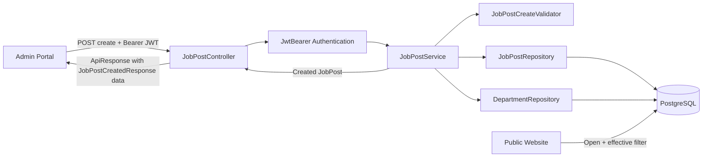
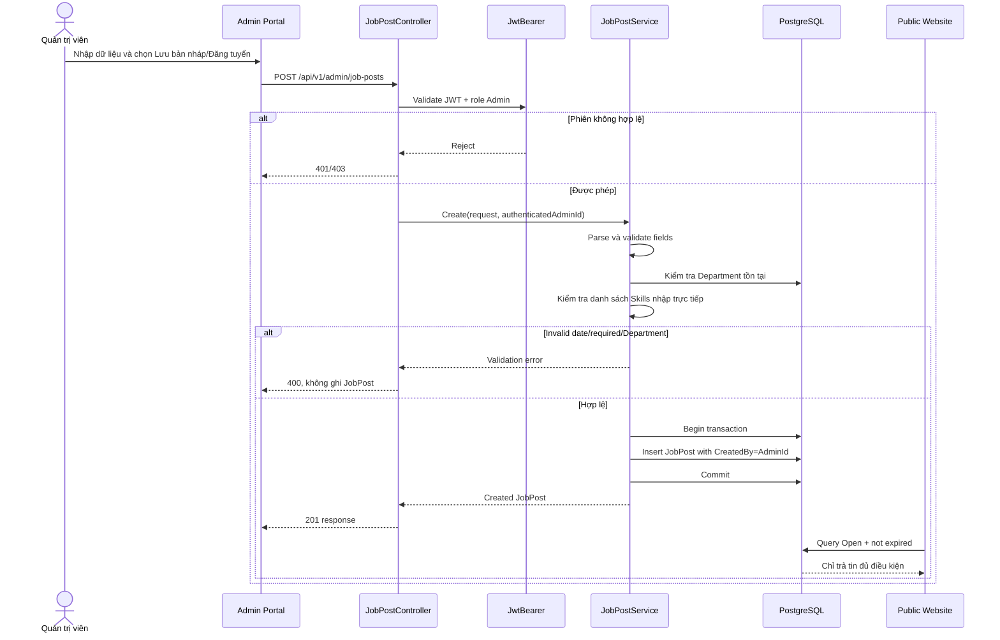
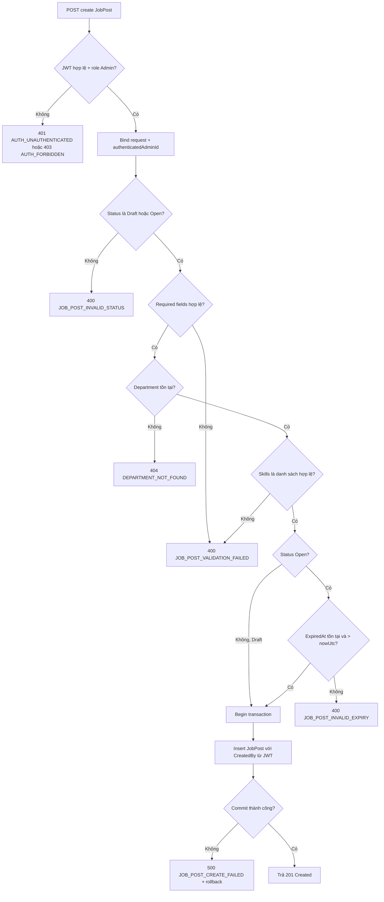
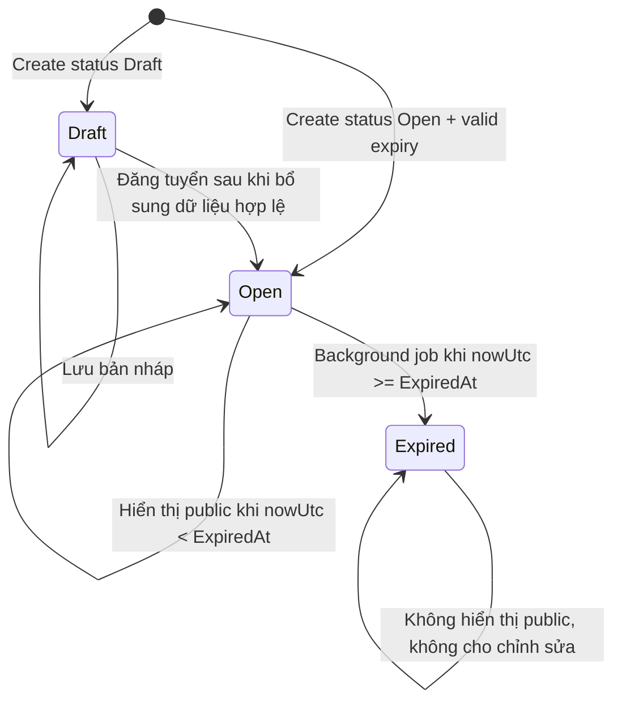
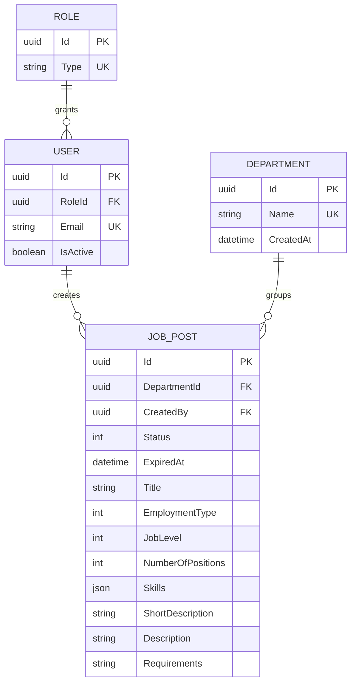

# TDD-005

## Document Info

- **Feature**: Tạo tin tuyển dụng và lưu bản nháp/đăng tuyển
- **Author**: Chưa chỉ định
- **Reviewer**: Chưa chỉ định
- **Status**: Draft
- **Version**: v1.0
- **Updated At**: 2026-09-21

## Context & Goals

### Current DB alignment

- `JobPost.Skills` is a `List<string>` stored as JSONB and is entered directly by Admin; there is no Skill table or Skill foreign key.
- `ExpiredAt` is mandatory and future-dated for `Open`; null is allowed only for `Draft`.
- `User.EmploymentStatus` is persisted in `User` as an integer enum.
- API enum values use Vietnamese labels at the display boundary.

### Problem

Khi VNZ có nhu cầu tuyển dụng, quản trị viên cần nhập thông tin vị trí rồi chọn lưu bản nháp hoặc đăng tuyển ngay. Tin bản nháp phải được giữ trong khu vực quản trị nhưng chưa xuất hiện trên website công khai. Tin đăng tuyển chỉ xuất hiện công khai khi trạng thái là `Open` và ngày hết hạn chưa đến.

Repository đã có `JobPost`, `Department`, `User`, enum tuyển dụng và `AppDbContext`. Chưa có endpoint tạo tin, validator hoặc service transaction.

### Goals

- Chỉ Admin đã xác thực mới được tạo tin.
- Lưu được tin ở `Draft` hoặc tạo trực tiếp ở `Open`.
- Kiểm tra dữ liệu bắt buộc trước khi đăng tuyển.
- Từ chối ngày hết hạn không hợp lệ khi đăng tuyển.
- Ghi `CreatedBy` bằng UserId của Admin đang đăng nhập.
- Kiểm tra Department được chọn có tồn tại.
- Với Open, kiểm tra `Skills` là danh sách có ít nhất một chuỗi không rỗng sau khi trim; Admin nhập trực tiếp, không đối chiếu catalog.
- Không hiển thị Draft trên website công khai; chỉ hiển thị Open còn hiệu lực.
- Tạo JobPost trong một transaction, không lưu record chưa hoàn chỉnh khi validation/persistence thất bại.
- Cho phép tin Open được chỉnh sửa ở chức năng tuyển dụng tiếp theo mà không làm thay đổi snapshot của hồ sơ ứng tuyển cũ.

### Non-goals

- Tạo mới Department trong chức năng này.
- Chỉnh sửa tin đã tạo.
- Xóa hoặc đóng tin tuyển dụng.
- Tạo hồ sơ ứng tuyển.
- Tạo hoặc quản lý Skill entity/catalog.

## Architecture



Notes:

- `JobPost` là source of truth cho tin tuyển dụng; `User` là source of truth cho người tạo; `Department` là source of truth cho phòng ban.
- `CreatedBy` lấy từ claims đã xác thực, không nhận từ request body.
- Validation độc lập phải chạy trước transaction write.
- Lưu Draft và đăng Open dùng cùng endpoint nhưng khác `status`; Draft không yêu cầu `ExpiredAt` hợp lệ để public.
- Open yêu cầu dữ liệu bắt buộc đầy đủ, Department tồn tại, `Skills` hợp lệ và `ExpiredAt > nowUtc`.
- Không gọi external service. Không có idempotency key trong Story; nên có request deduplication ở tầng UI nhưng không tạo thêm contract backend.
- BR-014 được đáp ứng bằng việc kiểm tra Department tồn tại và kiểm tra trực tiếp giá trị `Skills` do Admin nhập; không có Skill catalog, Skill entity hoặc Skill FK.

## Sequence Diagram



## Activity Diagram



## State Diagram



`Expired` là trạng thái được lưu khi background job phát hiện `nowUtc >= ExpiredAt`; endpoint tạo không tự tạo record `Expired`. Chuyển Draft → Open sau khi tạo thuộc chức năng chỉnh sửa/đăng tin, không phải write operation của endpoint create này.

## Data Model

### Entity hiện có

`JobPost`, `Department`, `User` đã có trong `VNZ.Repository/Entity`; `AppDbContext` đã map các bảng và FK. `JobPost.Skills` là `List<string>` lưu JSONB, không phải quan hệ tới bảng kỹ năng.

| Entity/table | Field | Type | Required/Nullable | Key/Relationship/Constraint | Ownership/Lineage |
|---|---|---|---|---|---|
| `JobPost` / `Job_Post` | `Id` | UUID | Required | PK từ `BaseEntity` | System |
| `JobPost` / `Job_Post` | `DepartmentId` | UUID? | Nullable trong entity; required để Open | FK → `Department.Id` | Department source |
| `JobPost` / `Job_Post` | `CreatedBy` | UUID? | Nullable trong entity; set từ JWT khi create | FK → `User.Id` | BR-013 |
| `JobPost` / `Job_Post` | `Status` | `JobPostStatus` | Required | `Draft=1`, `Open=2`, `Closed=3`, `Expired=4` | BR-012 |
| `JobPost` / `Job_Post` | `ExpiredAt` | DateTime? | Nullable cho Draft; required for Open | UTC, must be future for Open | BR-007/011 |
| `JobPost` / `Job_Post` | `Title` | string | Required | Max 300 | Form input |
| `JobPost` / `Job_Post` | `EmploymentType` | `EmploymentType?` | Required for Open | Enum DB mapping | Form input |
| `JobPost` / `Job_Post` | `JobLevel` | `JobLevel?` | Required for Open | Enum DB mapping | Form input |
| `JobPost` / `Job_Post` | `NumberOfPositions` | int | Required for Open | >= 1 | Form input |
| `JobPost` / `Job_Post` | `Skills` | List<string> | Required for Open; `[]` allowed for Draft | JSONB; no Skill FK/catalog | Admin form input |
| `JobPost` / `Job_Post` | `ShortDescription`, `Description`, `Requirements` | string? | Required for Open; Draft policy follows BR-011 | Text validation | Form input |
| `Department` / `Department` | `Id`, `Name` | UUID, string | Required | PK, unique Name | BR-014 |
| `User` / `User` | `Id`, `Email`, `RoleId` | UUID, string, UUID? | Required for authenticated Admin | PK, FK Role | BR-013 |



Migration/compatibility:

- Không tạo Department, Skill entity, Skill table hoặc Skill catalog trong endpoint create.
- Các enum được lưu integer theo mapping hiện có.
- `CreatedBy` phải được set server-side; body field cùng tên bị reject hoặc ignore theo controller policy, không được dùng để giả mạo creator.
- BR-014 được thực thi bằng việc kiểm tra Department tồn tại và kiểm tra `Skills` là danh sách chuỗi nhập trực tiếp hợp lệ; không suy diễn thêm bảng hoặc catalog mới.

## Internal API

### Endpoints

- **POST** `/api/v1/admin/job-posts` — tạo tin tuyển dụng ở Draft hoặc Open.
  - Actor: Admin đã xác thực.
  - Header: `Authorization: Bearer <jwt>` bắt buộc.
  - Body JSON:

| Field | Type | Required | Validation |
|---|---|---:|---|
| `title` | string | Draft/Open | trim, non-empty, max 300 |
| `departmentId` | UUID | Open; Draft theo Department policy | phải tham chiếu Department tồn tại |
| `employmentType` | enum | Open | Internship/FullTime/PartTime/Contract |
| `jobLevel` | enum | Open | Intern/Fresher/Junior/Middle/Senior/Lead |
| `numberOfPositions` | integer | Open | >= 1 |
| `skills` | array&lt;string&gt; | Open | ít nhất một giá trị không rỗng sau khi trim; Admin nhập trực tiếp, không đối chiếu catalog |
| `shortDescription` | string | Open | non-empty |
| `description` | string | Open | non-empty |
| `requirements` | string | Open | non-empty |
| `expiredAt` | ISO datetime UTC | Open | non-null và `> nowUtc` |
| `status` | enum | Có | chỉ `Draft` hoặc `Open`; không nhận `Closed` |

  - Các field body không có trong contract bị reject với `JOB_POST_INVALID_REQUEST` để tránh client tự truyền `CreatedBy`, `Id`, audit fields.
  - `CreatedBy` lấy từ authenticated user claim, không từ body.
  - Success Draft: HTTP 201, `status=Draft`, không public.
  - Success Open: HTTP 201, `status=Open`, public query được phép trả khi còn hiệu lực.
  - Write transaction: insert JobPost và commit; không tạo Department hay Skill entity/catalog.

### Examples

#### POST /api/v1/admin/job-posts — lưu bản nháp

```http
POST /api/v1/admin/job-posts HTTP/1.1
Authorization: Bearer <valid-admin-jwt>
Content-Type: application/json

{"title":"Backend Developer","departmentId":"aaaaaaaa-aaaa-aaaa-aaaa-aaaaaaaaaaaa","employmentType":"FullTime","jobLevel":"Junior","numberOfPositions":2,"skills":["C#","PostgreSQL"],"shortDescription":"Phát triển dịch vụ backend","description":"Xây dựng API cho nền tảng VNZ, bao gồm quyền lợi.","requirements":"Có kinh nghiệm .NET.","expiredAt":null,"status":"Draft"}
```

```json
{"success":true,"message":"Lưu tin tuyển dụng thành công.","data":{"id":"11111111-1111-1111-1111-111111111111","status":"Bản nháp","createdBy":"bbbbbbbb-bbbb-bbbb-bbbb-bbbbbbbbbbbb","createdAt":"2026-09-21T10:00:00Z","isPubliclyVisible":false},"errors":null,"traceId":null,"timestampUtc":"2026-09-21T10:00:00Z"}
```

Đáp ứng ALT-01 và AC-001.

#### POST /api/v1/admin/job-posts — đăng tuyển ngay

```json
{"title":"Backend Developer","departmentId":"aaaaaaaa-aaaa-aaaa-aaaa-aaaaaaaaaaaa","employmentType":"FullTime","jobLevel":"Junior","numberOfPositions":2,"skills":["C#","PostgreSQL"],"shortDescription":"Phát triển dịch vụ backend","description":"Xây dựng API cho nền tảng VNZ, bao gồm quyền lợi.","requirements":"Có kinh nghiệm .NET.","expiredAt":"2026-10-01T00:00:00Z","status":"Open"}
```

```json
{"success":true,"message":"Đăng tin tuyển dụng thành công.","data":{"id":"22222222-2222-2222-2222-222222222222","status":"Đang tuyển","createdBy":"bbbbbbbb-bbbb-bbbb-bbbb-bbbbbbbbbbbb","createdAt":"2026-09-21T10:05:00Z","isPubliclyVisible":true},"errors":null,"traceId":null,"timestampUtc":"2026-09-21T10:05:00Z"}
```

HTTP 201; tin public khi `nowUtc < expiredAt`. Đáp ứng ALT-02 và AC-002.

#### POST /api/v1/admin/job-posts — ngày hết hạn không hợp lệ

```json
{"success":false,"message":"Ngày hết hạn phải sau thời điểm hiện tại.","data":null,"errors":{"code":"JOB_POST_INVALID_EXPIRY","fields":["expiredAt"]},"traceId":"00-1bd9b83f1d0610560f0e52aed8196506-2bf630f9ce1a8a1a-00","timestampUtc":"2026-09-21T10:00:00Z"}
```

HTTP 400; không insert JobPost, đáp ứng EXC-01 và AC-003.

#### POST /api/v1/admin/job-posts — thiếu field bắt buộc khi đăng

```json
{"success":false,"message":"Vui lòng nhập đầy đủ thông tin bắt buộc để đăng tin.","data":null,"errors":{"code":"JOB_POST_VALIDATION_FAILED","fields":["title","description","requirements"]},"traceId":"00-1bd9b83f1d0610560f0e52aed8196506-2bf630f9ce1a8a1a-00","timestampUtc":"2026-09-21T10:00:00Z"}
```

HTTP 400; không insert hoặc commit partial record, đáp ứng EXC-02.

#### POST /api/v1/admin/job-posts — Department không tồn tại

```json
{"success":false,"message":"Phòng ban không tồn tại.","data":null,"errors":{"code":"DEPARTMENT_NOT_FOUND","fields":["departmentId"]},"traceId":"00-4bf92f3577b34da6a3ce929d0e0e4736-00f067aa0ba902b7-00","timestampUtc":"2026-09-21T10:00:00Z"}
```

HTTP 404; không insert JobPost, đáp ứng EXC-03 và BR-014.

#### POST /api/v1/admin/job-posts — chưa xác thực

```json
{"success":false,"message":"Yêu cầu đăng nhập để tiếp tục.","data":null,"errors":{"code":"AUTH_UNAUTHENTICATED","fields":[]},"traceId":"00-1bd9b83f1d0610560f0e52aed8196506-2bf630f9ce1a8a1a-00","timestampUtc":"2026-09-21T10:00:00Z"}
```

HTTP 401/403 theo authentication/authorization; không query master data và không ghi database.

### Error Codes

| Code | HTTP | Điều kiện | Field | Retryable | Data side effect |
|---|---:|---|---|---|---|
| `AUTH_UNAUTHENTICATED` | 401 | JWT thiếu/invalid/expired | Authorization | Sau login lại | Không |
| `AUTH_FORBIDDEN` | 403 | JWT hợp lệ nhưng không có role Admin | Authorization | Không | Không |
| `JOB_POST_INVALID_REQUEST` | 400 | JSON sai kiểu hoặc chứa field bị cấm | Body | Không | Không |
| `JOB_POST_INVALID_STATUS` | 400 | Status khác Draft/Open | status | Không | Không |
| `JOB_POST_VALIDATION_FAILED` | 400 | Thiếu hoặc sai dữ liệu bắt buộc | Body fields | Không | Không |
| `JOB_POST_INVALID_EXPIRY` | 400 | Open không có expiry hoặc expiry không ở tương lai | expiredAt | Không | Không |
| `DEPARTMENT_NOT_FOUND` | 404 | DepartmentId không tham chiếu Department tồn tại | departmentId | Không | Không |
| `JOB_POST_CREATE_FAILED` | 500 | Insert/transaction failure | — | Có thể retry | Rollback |
| `INTERNAL_ERROR` | 500 | Lỗi không dự kiến | — | Có thể retry | Rollback nếu đang transaction |

## External API

### Endpoints

Feature không gọi hệ thống bên thứ ba. Public website là consumer nội bộ đọc `JobPost` theo BR-007, không phải external API trong scope này.

### Fields

Không có external request/response mapping.

### Error Handling

Không có provider timeout/retry. Lỗi PostgreSQL hoặc transaction map thành `JOB_POST_CREATE_FAILED` và rollback.

### Quirks

Draft có thể có `ExpiredAt=null`; Open phải có ngày hết hạn tương lai. Tin Open hết hạn không còn public nhưng vẫn được giữ để quản trị xử lý ở các Story sau.

## References

### User Stories

- `STORY-005` — Là một quản trị viên, tôi muốn tạo tin tuyển dụng để có thể lưu bản nháp hoặc đăng một vị trí tuyển dụng mới. Version `v0.1`, approval state `Draft`.

### Business Rules

- `BR-007` — Điều kiện hiển thị tin tuyển dụng trên website công khai. Version `v0.1`, approval state `Draft`, effective date `2026-09-21`.
- `BR-009` — Cho phép chỉnh sửa tin tuyển dụng đã đăng. Version `v0.1`, approval state `Draft`, effective date `2026-09-21`.
- `BR-010` — Bảo toàn nội dung tuyển dụng tại thời điểm ứng viên nộp hồ sơ. Version `v0.1`, approval state `Draft`, effective date `2026-09-21`.
- `BR-011` — Không ghi nhận thay đổi tuyển dụng không hợp lệ. Version `v0.1`, approval state `Draft`, effective date `2026-09-21`.
- `BR-012` — Trạng thái ban đầu khi tạo tin tuyển dụng. Version `v0.1`, approval state `Draft`, effective date `2026-09-21`.
- `BR-013` — Ghi nhận người tạo tin tuyển dụng. Version `v0.1`, approval state `Draft`, effective date `2026-09-21`.
- `BR-014` — Phòng ban hợp lệ và kỹ năng do quản trị viên nhập. Version `v0.1`, approval state `Draft`, effective date `2026-09-21`.

### Use Cases

- Không có tài liệu Use Case riêng.

### Others

- `VNZ.Repository/Entity/JobPost.cs`: entity tin tuyển dụng.
- `VNZ.Repository/Entity/Department.cs`: entity phòng ban.
- `VNZ.Repository/Entity/User.cs`: entity Admin/creator.
- `VNZ.Repository/Entity/Enum/JobPostStatus.cs`, `EmploymentType.cs`, `JobLevel.cs`: enum DB.
- `VNZ.Repository/Data/AppDbContext.cs`: DbSet, FK, enum conversion và index.
- `VNZ.Service/Models/ApiResponse.cs`: response envelope hiện có.
- `VNZ.Api/Middleware/GlobalExceptionHandlerMiddleware.cs`: middleware mapping lỗi hiện có.

## Schema Amendments

- `JobPost.Skills` is an admin-entered `List<string>` stored as PostgreSQL JSONB; there is no Skill table or Skill foreign key.
- `Open` requires a non-null `ExpiredAt` later than current UTC time; only Draft may omit it.
- `User.EmploymentStatus` is persisted in the `User` table as an integer enum.
- API enum values are rendered with Vietnamese labels: `Draft` = `Bản nháp`, `Open` = `Đang tuyển`, `Closed` = `Đã đóng`, `Expired` = `Đã hết hạn`.

## Change Log

#### v1.0 (2026-09-21)

- **Change**: Tạo TDD cho `STORY-005`, bao phủ AC-001 đến AC-005, ALT-01/ALT-02, EXC-01 đến EXC-03 và BR-007, BR-009 đến BR-014.
- **Author**: Chưa chỉ định.
