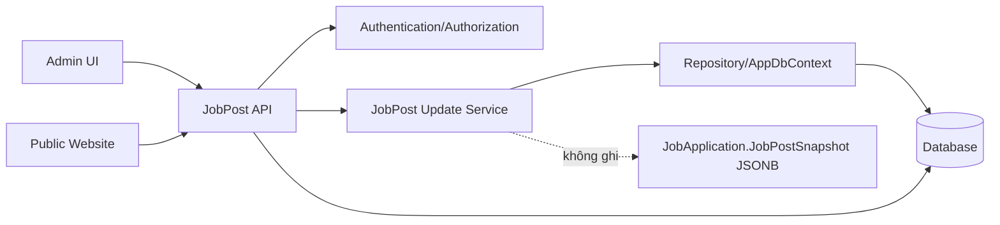
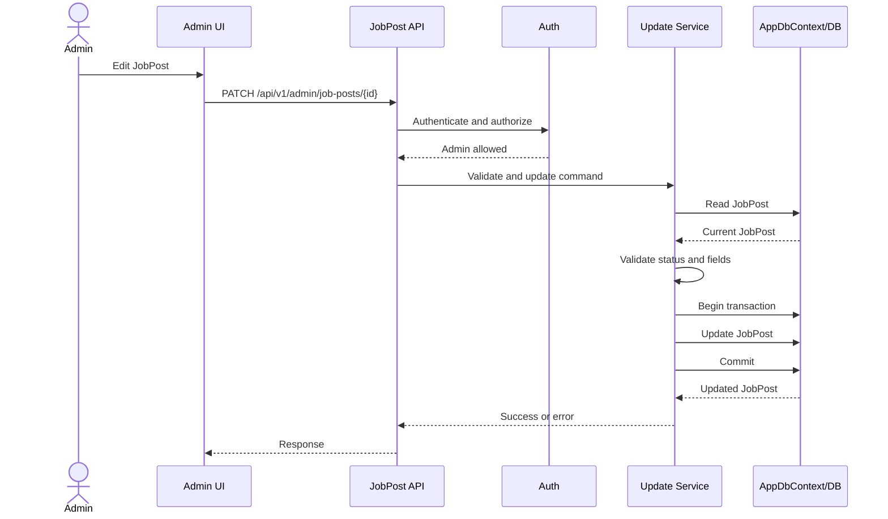
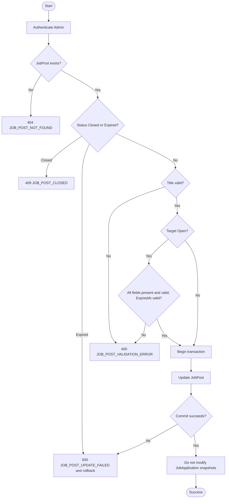
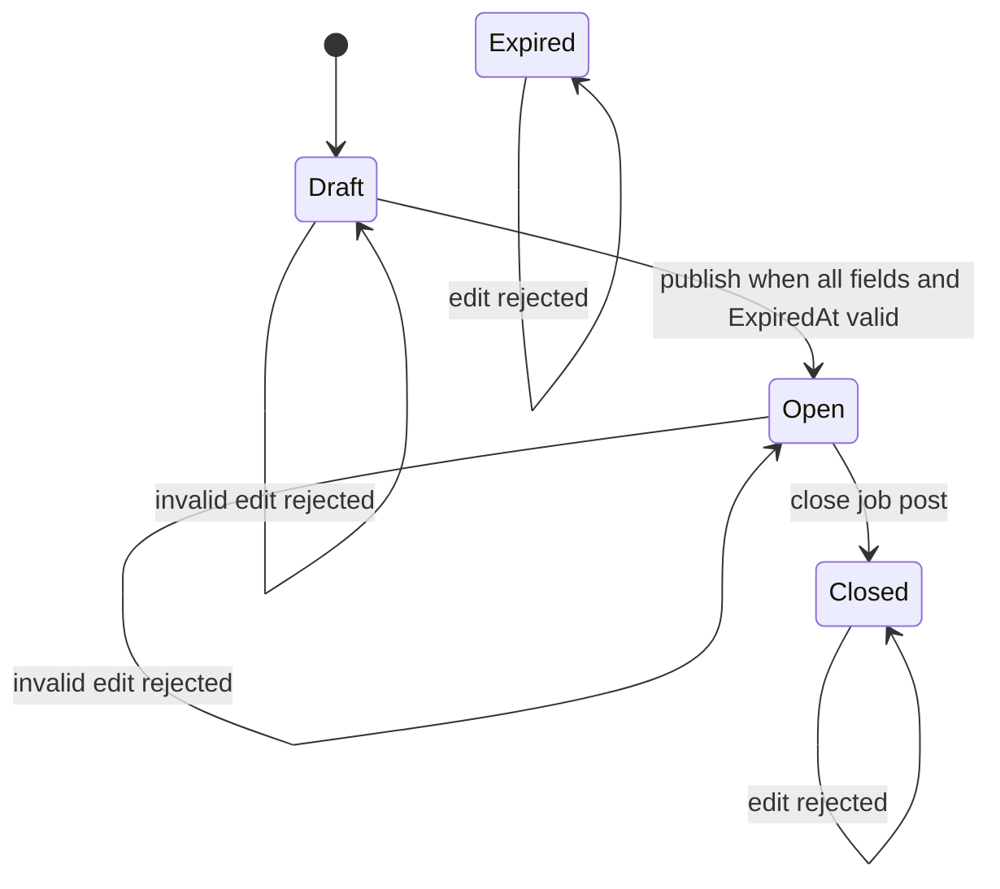
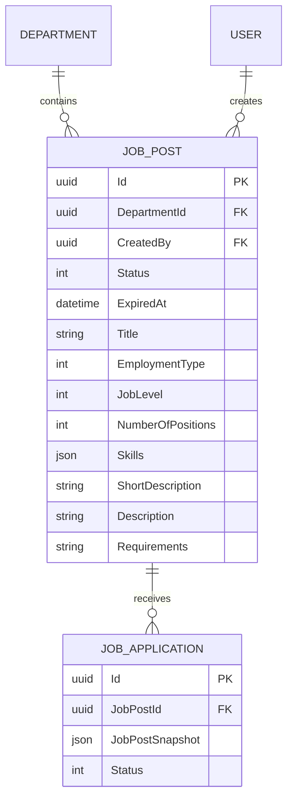

# TDD-006

## Document Info

- **Feature**: Cập nhật tin tuyển dụng
- **Author**: Chưa chỉ định
- **Reviewer**: Chưa chỉ định
- **Status**: Draft
- **Version**: v1.0
- **Updated At**: 2026-09-21

## Context & Goals

### Problem

Admin cần chỉnh sửa JobPost ở trạng thái Draft hoặc Open khi nhu cầu tuyển dụng thay đổi. Nội dung đã gắn với JobApplication trước khi chỉnh sửa phải được giữ nguyên.

### Goals

- Cho phép cập nhật JobPost Draft và Open.
- Khi lưu Draft, chỉ Title bắt buộc; các field còn lại có thể null/rỗng theo DB.
- Khi đăng hoặc lưu Open, toàn bộ field phải đầy đủ, hợp lệ và ExpiredAt phải có giá trị hợp lệ.
- Closed là trạng thái terminal và không được chỉnh sửa.
- Không thay đổi JobApplication.JobPostSnapshot.
- Closed và Expired là trạng thái terminal, không được chỉnh sửa; background job chạy khi khởi động và mỗi phút chuyển Open sang Expired khi nowUtc >= ExpiredAt.
- Cập nhật thất bại phải rollback, giữ nguyên dữ liệu cũ.

### Non-goals

- Không sửa hoặc xóa snapshot lịch sử.
- Không tạo Skill entity/catalog mới.
- Không gọi external API.

## Architecture



JobPost là live source. JobApplication.JobPostSnapshot là historical snapshot bất biến. Cập nhật JobPost nằm trong một transaction; không có external call. Nếu persistence thất bại, transaction rollback và snapshot không bị chạm tới.

## Sequence Diagram



## Activity Diagram



## State Diagram



## Data Model

Không thêm entity, field hoặc schema mới. Bám theo entity hiện tại:

| Entity | Field | Type | Draft | Open | Ghi chú |
|---|---|---|---|---|---|
| JobPost | Id | Guid | Required | Required | PK, BaseEntity |
| JobPost | DepartmentId | Guid? | Nullable | Required | FK khi có giá trị |
| JobPost | CreatedBy | Guid? | Nullable | Nullable | FK hiện có |
| JobPost | Status | JobPostStatus | Draft/Open | Open | Closed/Expired không sửa |
| JobPost | Title | string | Required | Required | Không rỗng sau trim |
| JobPost | EmploymentType | EmploymentType? | Nullable | Required | Enum int trong DB |
| JobPost | JobLevel | JobLevel? | Nullable | Required | Enum int trong DB |
| JobPost | NumberOfPositions | int | Theo entity | Required hợp lệ | Không tự thêm giới hạn chưa có |
| JobPost | Skills | List<string> | Nullable/rỗng | Required hợp lệ | JSONB, admin nhập trực tiếp |
| JobPost | ShortDescription | string? | Nullable | Required |  |
| JobPost | Description | string? | Nullable | Required |  |
| JobPost | Requirements | string? | Nullable | Required |  |
| JobPost | ExpiredAt | DateTime? | Có thể null | Required, hợp lệ | Open phải có giá trị |
| JobApplication | JobPostSnapshot | JSONB | Existing | Existing | Không cập nhật khi JobPost sửa |



## Internal API

### Endpoints

- **PATCH** `/api/v1/admin/job-posts/{id}` — Admin cập nhật JobPost Draft hoặc Open.
- Path `id`: Guid, required, phải tồn tại.
- Request dùng các field hiện có: `DepartmentId`, `Title`, `EmploymentType`, `JobLevel`, `NumberOfPositions`, `Skills`, `ShortDescription`, `Description`, `Requirements`, `ExpiredAt`, `Status`.
- Draft: chỉ `Title` bắt buộc; field khác nullable/rỗng theo DB.
- Open: tất cả field phải đầy đủ và hợp lệ; `ExpiredAt` bắt buộc có giá trị hợp lệ.
- `Status` chỉ cho Draft/Open trong thao tác sửa; Closed và Expired bị từ chối.
- Unknown field: reject theo convention validation hiện tại.
- Validation phải hoàn tất trước transaction. Chỉ sau khi hợp lệ mới update JobPost và commit.
- Response success trả JobPost hiện tại, giữ nullability theo entity và label enum tiếng Việt ở presentation mapping hiện có.

### Examples

#### PATCH /api/v1/admin/job-posts/{id} — Draft

```json
{"title":"Backend Developer - Draft","status":"Draft"}
```

HTTP 200; JobPost được cập nhật, các field khác có thể null/rỗng, không hiển thị công khai.

#### PATCH /api/v1/admin/job-posts/{id} — Open

```json
{"title":"Senior .NET Developer","departmentId":"22222222-2222-2222-2222-222222222222","employmentType":"FullTime","jobLevel":"Senior","numberOfPositions":2,"skills":["C#","ASP.NET Core"],"shortDescription":"Build backend services","description":"Detailed job description","requirements":"5 years experience","expiredAt":"2026-12-31T17:00:00Z","status":"Open"}
```

HTTP 200; JobPost tiếp tục Open nếu còn hiệu lực và website đọc nội dung mới.

#### Validation failure

```json
{"title":"","status":"Open","expiredAt":null}
```

HTTP 400, `JOB_POST_VALIDATION_ERROR`; JobPost cũ không đổi.

#### Closed

HTTP 409, `JOB_POST_CLOSED`; không ghi JobPost và không chạm snapshot.

#### Persistence failure

HTTP 500, `JOB_POST_UPDATE_FAILED`; rollback transaction, JobPost cũ tiếp tục hiệu lực.

### Error Codes

- **JOB_POST_EXPIRED** (409): JobPost đã hết hạn, không được chỉnh sửa.

- **AUTHENTICATION_REQUIRED** (401): thiếu hoặc sai xác thực.
- **FORBIDDEN** (403): người dùng không có quyền Admin.
- **JOB_POST_NOT_FOUND** (404): JobPost không tồn tại.
- **JOB_POST_VALIDATION_ERROR** (400): Title, enum, array, field bắt buộc khi Open hoặc ExpiredAt không hợp lệ.
- **JOB_POST_CLOSED** (409): JobPost đã Closed, không được chỉnh sửa.
- **JOB_POST_UPDATE_FAILED** (500): lỗi persistence/transaction; dữ liệu cũ được giữ nguyên.

## External API

### Endpoints

Feature không gọi hệ thống bên thứ ba.

### Fields

Không có external request/response.

### Error Handling

Không có provider timeout, retry hoặc provider error.

### Quirks

Không có hành vi bất thường của hệ thống ngoài.

## References

### User Stories

- STORY-006 — “Là một quản trị viên, tôi muốn chỉnh sửa tin tuyển dụng đã tạo để cập nhật thông tin khi nhu cầu tuyển dụng thay đổi.” — v0.1, Draft.

### Business Rules

- BR-007 — v0.1, Draft.
- BR-009 — v0.1, Draft.
- BR-010 — v0.1, Draft.
- BR-011 — v0.1, Draft.

### Use Cases

Không có tài liệu Use Case riêng.

### Others

- `VNZ.Repository/Entity/JobPost.cs`
- `VNZ.Repository/Entity/JobApplication.cs`
- `VNZ.Repository/AppDbContext.cs`

## Change Log

#### v1.0 (2026-09-21)

- **Change**: Tạo TDD cho STORY-006.
- **Author**: Chưa chỉ định.
